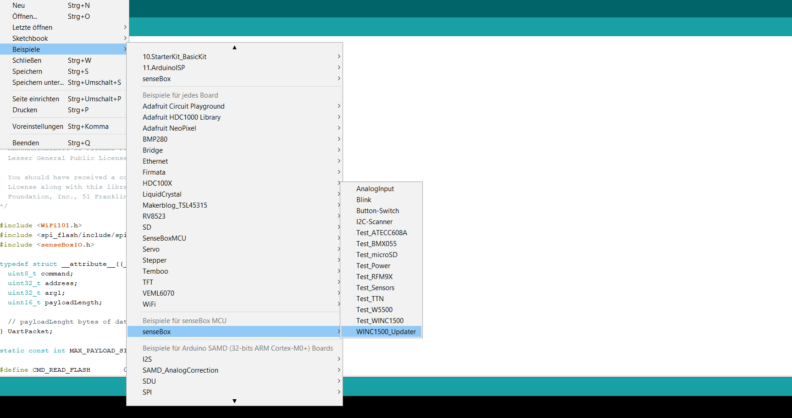
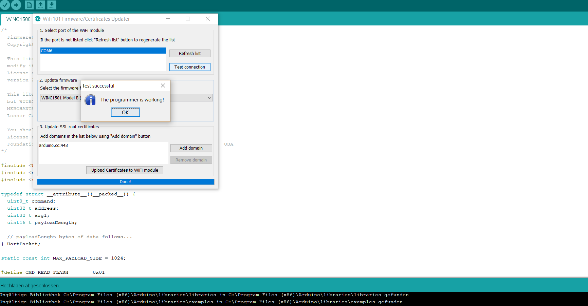

# Firmware Update Wifi-Bee {#head}

Leider haben einige unserer WiFi Bees vom Typ WINC1500 eine veraltete Firmware (Version 19.4.4) installiert. Leider gibt es keine andere Möglichkeit dieses Firmware zu updaten als es manuell durchzuführen. Im folgenden Kapitel wird erklärt wie man rausfindet welche Firmware man benutzt und (falls man eine veraltete Version hat) wie man diese updatet.

     
     

## Test der Version

Zuerst muss rausgefunden werden, welche Version das gelieferte WiFi-Bee hat. Gehe dazu auf `Datei` -> `Beispiele` und unter `"Beispiele für senseBox MCU"` auf `Test_WINC1500`.

Lade nun den Sketch auf dein Board (durch klicken des Pfeil-Symbols). Beachte, dass auf deinem senseBox Board das WiFi-Bee aufgesteckt sein muss (bitte auf XBEE1 aufstecken). Klicke dann auf den seriellen Monitor (durch klicken des Lupen-Symbols) und es wird geprüft ob dein Wifi-Bee funktionsfähig ist und angezeigt welche Firmware darauf installiert ist.

    <i class="fa fa-check fa-fw" aria-hidden="true" style="color: #50af51;"></i>
   Wenn du eine Firmware <b>19.5.2, oder höher</b> hast kannst du hier abbrechen. Dein WiFi-Bee funktioniert einwandfrei.

    <i class="fa fa-exclamation-circle fa-fw" aria-hidden="true" style="color: #f0ad4e"></i>
    Wenn du eine Firmware geringer als <b>19.5.2</b> hast musst du leider die Firmware updaten. Wie das funktioniert erfährst du im nächsten Schritt.

## WiFi-Bee Firmware Update

Um die Firmware upzudaten, folge dem Pfad von oben: `Datei` -> `Beispiele` und unter `"Beispiele für senseBox MCU"` auf `WINC1500_Updater`.

Lade nun den Sketch auf dein Board (durch klicken des Pfeil-Symbols), auf welchem das WiFi-Bee aufgesteckt ist (bitte auf XBEE1 aufstecken).

    <i class="fa fa-exclamation-triangle fa-fw" aria-hidden="true" style="color: #d9534f"></i>
    Öffne dieses Mal nicht den seriellen Monitor (nicht auf das Lupen-Symbols klicken)

Jetzt auf ``Werkzeuge`` klicken und ``Wifi 101 Firware Updater`` auswählen.

Zuerst kannst du die Verbindung testen, indem du auf den angezeigten ``COM Port`` klickst und danach auf ``Test connection``. Es sollte folgende Information zurück kommen: "The programmer is working!"

Fast geschafft, jetzt nur noch auf ``Update Firmware`` klicken und der Upload beginnt. Danach sollte eine Erfolgsmeldung kommen "The firmware has been updated!".

    <i class="fa fa-info fa-fw" aria-hidden="true" style="color: #42acf3;"></i>
    Nicht davon irritieren lassen, dass es auch eine Version der Firmware 19.5.4 gibt, diese aber nicht in Arduino zu finden ist wenn man die Firmware updaten möchte. Diese Firmware wird mit dem Arduino Release 1.8.6 integriert und ist ab dann zu finden.

Wir entschuldigen uns für den Umweg und wünschen auch weiterhin viel Spaß mit der senseBox.

Falls dir dieser Artikel nicht weitergeholfen hat, kannst du versuchen auf www.forum.sensebox.de nach einer Lösung suchen, oder gegebenenfalls selbst einen Beitrag einreichen.
