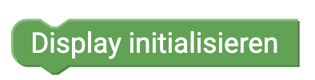
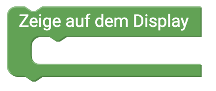
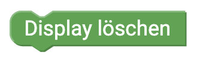
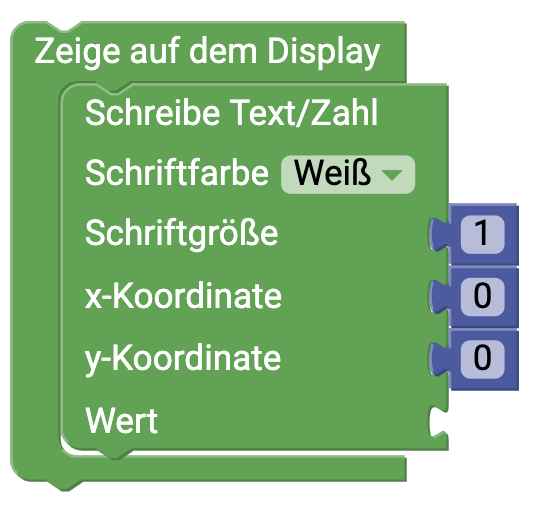
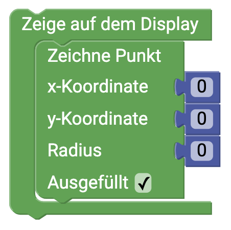
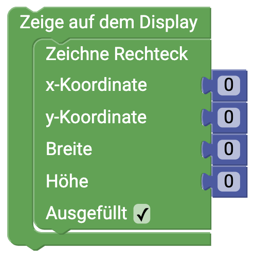
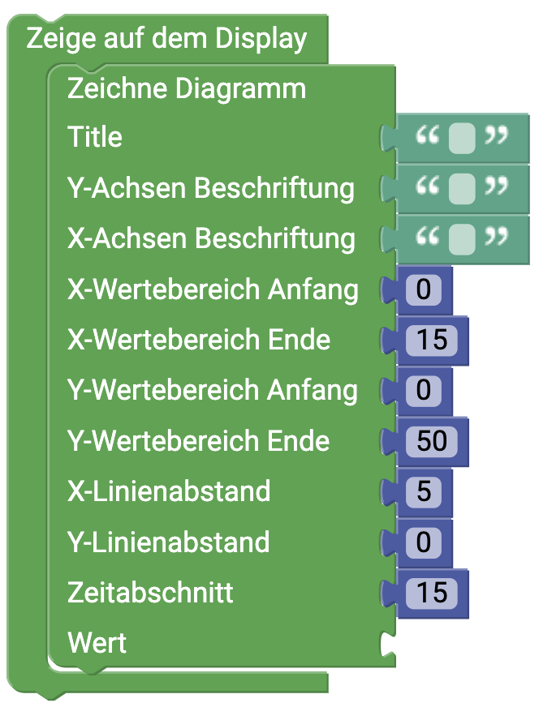

# senseBox Display {#head}

 Diese Seite gibt dir eine Übersicht über die verschiedenen Möglichkeiten des Displays der senseBox

     
     

    

        

            
        

        

            <h4>Das OLED-Display</h4>
            <h6>Anschluss: I2C/Wire</h6>
            Das OLED-DISPLAY hat eine Auflösung von 128x64 Pixeln und wird über den I2C Anschluss angeschlossen. Um das Display
            zu verwenden muss es im Setup() initialisiert werden.
        

    

    

    

        

            
        

        

            <h4>Anzeige auf dem Display</h4>
            Verwende diesen Block, wenn du eine stationäre senseBox registriert hast. Für jeden Messwert benögtist du jeweils einen eigenen
            Block, denn jeder Sensor/Messwert erhält zusätzlich zur senseBox ID eine spezifische und einmalige Sensor ID.
            Kopiere die jeweilige Sensor ID aus der Übersicht deiner Registrierung und hänge eine Messwert an, der Übertragen
            werden soll. Ziehe diesen Block in die Schleife des Blocks, der eine Verbindung zur openSenseMap herstellt.
        

    

    

    

        

            
        

        

            <h4>Display löschen</h4>
            Verwende diesen Block um den Inhalt des Displays zu löschen. Es empfiehlt sich am Anfang oder Ende der Endlosschleife das
            Display zu löschen um ein korrektes Anzeigen von z.B. Messwerten zu gewährleisten.
        

    

    

    

        

            
        

        

            <h4>Anzeigen von Text</h4>
            Mit diesem Block kannst du dir Text und Messwerte auf dem Display anzeigen lassen. Die Schriftfarbe ist Standardmäßig auf
            Weiß eingestellt, da das Display einen schwarzen Hintergrund hat. Du kannst neben der Schriftfarbe auch die Schriftgröße
            ändern. In Schriftgröße 1 ist ein Buchstabe oder eine Zahl 8 Pixel groß und du kannst dir insgesamt in 8 Zeilen
            auf dem Display verschiedene Texte anzeigen lassen. In Schriftgröße 2 sind die Buchstaben oder Zahlen 16 Pixel
            hoch. Mit den X- und Y-Werten gibst du an wo auf dem Display etwas angezigt wird.
        

    

    

        

            
        

        

            <h4>Zeichne Punkt</h4>
        Mit diesem Block kann ein Punkt auf dem Display angezeigt werden. Über die Koordinaten kannst du den Punkt auf dem Display platzieren und mithilfe des Radius die größe bestimmen.     
        

    

    

        

            
        

        

            <h4>Zeichne Rechteck</h4>
            Dieser Block zeichnet ein Rechteck auf das Display. Mit den X- und Y-Koordinaten wird die Position der oberen linken Ecke des Rechtecks auf dem Display bestimmt. Die Höhe und Breite wird in Pixeln angegeben und mit der Checkbox "Ausgefüllt" kann ausgewählt werden ob das Rechteck ausgefüllt oder nur als Rahmen angezeigt wird.
        

    

 

    

        

            
        

        

            <h4>Anzeigen von Diagrammen</h4>
            Mit diesem Block können automatisch Diagramme auf dem Display erstellt werden. 
        

    

