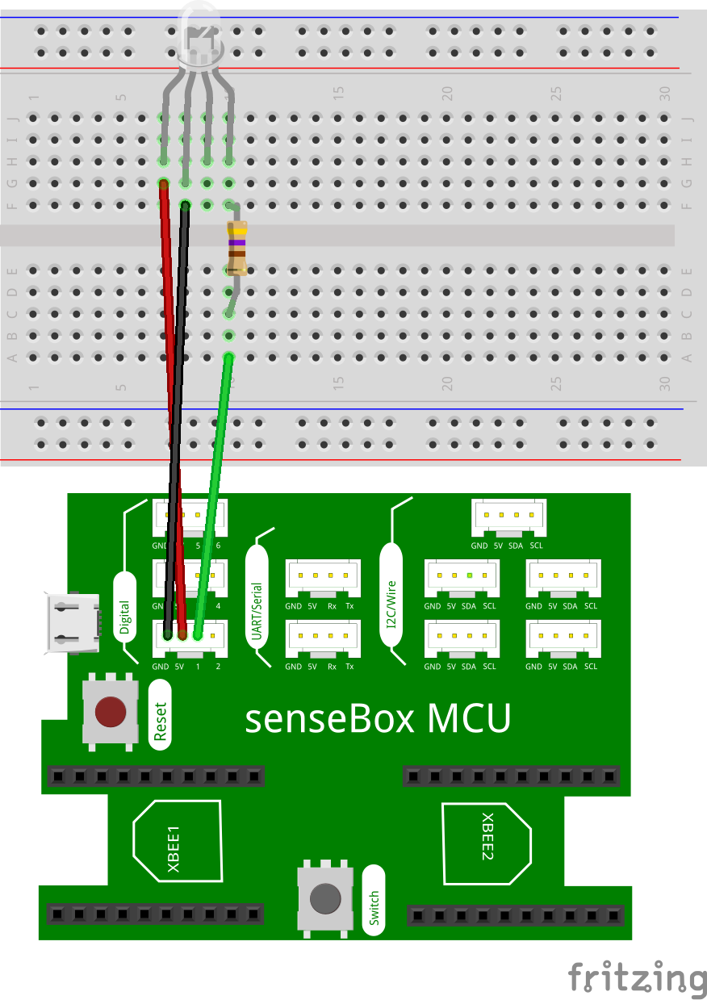

# LED {#head}

Diese Seite gibt dir eine Übersicht über die verschiedenen Ausgabemöglichkeiten der senseBox

     
     

    

        

            
        

        

            <h4>Die LED</h4>
            <h6>Anschluss: Digital</h6>
            Die Einfachste Ausgabemöglichkeit wird über den Anschluss einer LED gesteuert. Wähle im Dropdown Menü den richtigen Anschlusspin
            aus und den Status der LED
             
            <!-- Button trigger modal -->
            <button type="button" class="btn-modal" data-toggle="modal" data-target="#ledModal">
                Schaltung
            </button>

            <!-- Modal -->
            

                

                    

                        

                            <h5 class="modal-title" id="ledModalLabel">Schaltung - LED</h5>
                            <button type="button" class="close" data-dismiss="modal" aria-label="Close">
                                &times;
                            </button>
                        

                        

                            
                        

                        

                            <button type="button" class="btn btn-modal" data-dismiss="modal">Schließen</button>
                        

                    

                

            

        

    

    

        

            
        

        

            <h4>Die RGB-LED</h4>
            <h6>Anschluss: Digital</h6>
            Die RGB-LED kann verschiedenen Farben anzeigen. Die Farbe setzt sich immer aus den Farbwerten Rot, Grün, Blau zusammen. So lassen sich alle möglichen Farben erstellen. 

               <!-- Button trigger modal -->
               <button type="button" class="btn-modal" data-toggle="modal" data-target="#rgb-ledModal">
                Schaltung
            </button>

            <!-- Modal -->
            

                

                    

                        

                            <h5 class="modal-title" id="rgb-ledModalLabel">Schaltung RGB-LED</h5>
                            <button type="button" class="close" data-dismiss="modal" aria-label="Close">
                                &times;
                            </button>
                        

                        

                            
                        

                        

                            <button type="button" class="btn btn-modal" data-dismiss="modal">Schließen</button>
                        

                    

                

            
       
        

    

