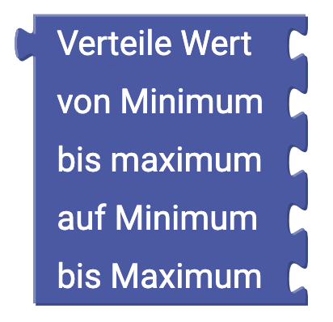

# Mathematik {#head}

Mit den "Mathematik"-Blöcken kannst du Werte einstellen und verschiedene Berechnungen durchführen.

     
     

    

        

            

        

        <h4>Der Wert-Block</h4>
            Mit dem Wert-Block kannst du Zahlen an einen anderen Block übermitteln. In diesen Block kannst du nur Zahlen eintragen, Buchstaben oder Sonderzeichen werden nicht akzeptiert.
         

    

    

        

            

        

            <h4>Der Rechnen-Block</h4>
            Mit diesem Block kannst du Zahlen addieren, subtrahieren, multiplizieren, dividieren oder potenzieren. Dieser Block ist nur mit anderen Blöcken, deren Eingabewerte Zahlen sind (z.B. der Wert-Block), verwendbar.
        

    

    

        

            
        

        

            <h4>Der Mathematische-Funktionen-Block</h4>
            Mit diesem Block kannst du einige mathematische Funktionen berechnen. Auch dieser Block funktioniert nur mit einem anderen Block, dessen Eingabewert eine Zahl ist.
        

    

    

        

            
        

        

            <h4>Der Konstanten-Block</h4>
            Mit diesem Block kannst du einige mathematische Konstanten hinzufügen.
        

    

    

        

            
        

        

            <h4>Der Erhöhe-Block</h4>
            Mit diesem Block kannst du den Wert einer numerischen Variable um einen bestimmten Betrag erhöhen.
        

    

    

        

            
        

        

            <h4>Der Runden-Block</h4>
            Mit diesem Block kannst du Werte runden. Beim Runden werden die Nachkommastellen auf 0 gesetzt, dabei wird je nach Größe der Nachkommastellen automatisch auf- oder abgerundet. Du kannst jedoch auch einstellen, dass immer auf- bzw. immer abgerundet wird.
        

    

    

        

            
        

        

            <h4>Der Begrenze-Block</h4>
            Dieser Block sorgt dafür, dass bestimmte Grenzwerte nicht überschritten werden. Dazu müssen drei Werte eingegeben werden:
            <ul>
                <li>Der zu prüfende Wert</li>
                <li>Die untere Grenze</li>
                <li>Die obere Grenze</li>
            </ul>

        

    

    

        

            
        

        

            <h4>Der Rest-von-Block</h4>
            Dieser Block führt eine Division durch und gibt dir den Rest aus.
        

    

    

        

            
        

        

            <h4>Der Zahleneigenschaften-Block</h4>
            Mit diesen Block kannst du prüfen, ob eine eingegebene Zahl eine bestimmte Eigenschaft aufweist.
        

    

    

        

            
        

        

            <h4>Der Trigonometrische-Funktionen-Block</h4>
            Mit diesem Block kannst du Sinus, Cosinus und Tangens sowie die dazugehörigen Unterfunktionen berechnen. Beachte, dass die Eingabewerte im Bogenmaß und nicht im Grad stehen.
        

    

    

        

            
        

        

                <h4>Der Verteile-Wert-Block</h4>
                Mit diesem Block kannst du Werte von einem Wertebereich in einen anderen übertragen. Dazu musst du einen zu verteilenden Wert und einen neuen Wertebereich eingeben. 
                
                <button type="button" class="btn-modal" data-toggle="modal" data-target="#Modal-Display-Example">
                    Verteile-Wert Beispiel
                </button>
    
                <!-- Modal begin -->
                

                    

                        

                            

                                <h5 class="modal-title" id="ModalLabelDisplayExample">Verteile-Wert Beispiel</h5>
                                <button type="button" class="close" data-dismiss="modal" aria-label="Close">
                                    &times;
                                </button>
                            

                            

                                

                                   In diesem Beispiel wird der analoge Geräuschsensor ausgelesen. Zuerst werden die gemessenen analogen Werte (Wertebereich von 0 bis 1023) direkt angezeigt.
                                   

                                        <h6 align="center">Blöcke ohne Verteilung</h6>
                                        
                                    

                                    

                                        <h6 align="center">Display Anzeige ohne Verteilung</h6>
                                        
                                    

                                

                                

                                    Hier werden die gemessenen Werte zusätzlich durch den Verteile-Wert-Block in einen neuen Wertebereich von 0 bis 10 übertragen.
                                    

                                        <h6 align="center">Blöcke mit Verteilung</h6>
                                        
                                    

                                    

                                        <h6 align="center">Display Anzeige mit Verteilung</h6>
                                        
                                    

                                

                            

                            

                                <button type="button" class="btn btn-modal" data-dismiss="modal">Schließen</button>
                            

                        

                    

                

            

    

    

        

            
        

        

            <h4>Der Zufallszahl-Block</h4>
            Dieser Block bestimmt eine Zufallszahl zwischen 0,0 und 1,0.
        

    

        

    

    

        

            
        

        

            <h4>Der Ganzzahlige-Zufallszahl-Block</h4>
            Mit diesem Block können ganzzahlige Zufallswerte innerhalb selbst festgelegter Grenzen erzeugt werden.
        

    

