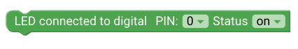
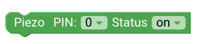
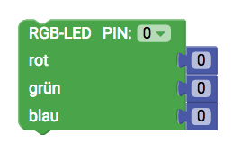

# senseBox Ausgabe {#head}

Diese Seite gibt dir eine Übersicht über die verschiedenen Ausgabemöglichkeiten der senseBox

     
     

    

        

            
        

        

            <h4>Die LED</h4>
            <h6>Anschluss: Digital</h6>
            Die Einfachste Ausgabemöglichkeit wird über den Anschluss einer LED gesteuert. Wähle im Dropdown Menü den richtigen Anschlusspin
            aus und den Status der LED
             
            <!-- Button trigger modal -->
            <button type="button" class="btn-modal" data-toggle="modal" data-target="#exampleModal">
                Schaltung
            </button>

            <!-- Modal -->
            

                

                    

                        

                            <h5 class="modal-title" id="exampleModalLabel">Schaltung</h5>
                            <button type="button" class="close" data-dismiss="modal" aria-label="Close">
                                &times;
                            </button>
                        

                        

                            
                        

                        

                            <button type="button" class="btn btn-modal" data-dismiss="modal">Schließen</button>
                        

                    

                

            

        

    

    

        

            
        

        

            <h4>Der Piezo</h4>
            <h6>Anschluss: Digital</h6>
            Der Piezo gibt einen Ton aus, wenn er mit Strom versorgt wird. Schließe den Piezo über einen der digitalen Anschlüsse an und verwenden diesen Block um den Anschluss mit Strom zu versorgen.
        

    

    

        

            
        

        

            <h4>Die RGB-LED</h4>
            <h6>Anschluss: Digital</h6>
            Die RGB-LED kann verschiedenen Farben anzeigen. Die Farbe setzt sich immer aus den Farbwerten Rot, Grün, Blau zusammen. So lassen sich alle möglichen Farben erstellen. 
        

    

    

        

            
        

        

            <h4>Auf Kommandozeile Ausgeben</h4>
            Mit der Kommandozeile kannst du dir Messwerte und Text ohne ein zusätzliches Display ausgeben lassen. Mit der Checkbox wird nach jeder Zeile ein Zeilenumbruch eingefügt. Wichtig: Um dir die Kommandozeile aufzurufen muss die Arduino IDE auf deinem Computer installiert sein!
        

    

