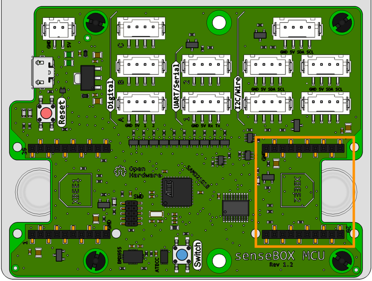
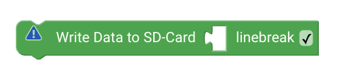

# senseBox SD Karte {#head}

Um Daten auf SD Karte zu Speichern benötigst du neben einer micro SD-Karte das mSD-Bee. 

    

        

            
        

        

            <h4>mSD Bee</h4>
            <!-- Button trigger modal -->
            <button type="button" class="btn-modal" data-toggle="modal" data-target="#bee2Modal">
                Anschluss: XBee2
            </button>

            <!-- Modal -->
            

                

                    

                        

                            <h5 class="modal-title" id="bee2ModalLabel">Anschluss: Xbee2</h5>
                            <button type="button" class="close" data-dismiss="modal" aria-label="Close">
                                &times;
                            </button>
                        

                        

                            
                        

                        

                            <button type="button" class="btn btn-modal" data-dismiss="modal">Schließen</button>
                        

                    

                

            

             
           Stecke das SD Bee auf den Xbee Steckplatz 2 und lege eine SD Karte ein. 
        

    

  

    

        

            
        

        

            <h4>Erstellen der Datei</h4>
            Um daten auf SD-Karte zu speichern werden verschiedene Blöcke benötigt. Im ersten Schritt wird im Setup() eine neue Datei erstellt. Du kannst mit diesem Block auch mehrere verschiedene Dateien erstellen. 
        

    

    

        

            
        

        

            <h4>Öffnen der Datei</h4>
           In Endlosschleife wird die jeweilige Datei geöffnet. Wenn die Datei geöffnet ist kannst du in die Datei schreiben. 
        

    

    

        

            
        

        

        <h4>Speichern in Datei</h4>
            Mit diesem Block schreibst du Messwerte oder Texte in die geöffnete Datei. 
        

    

