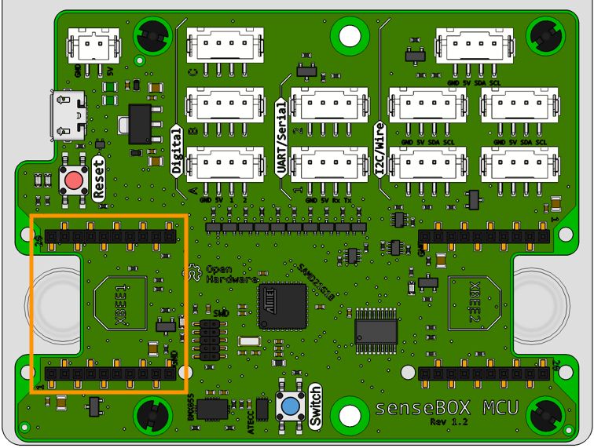
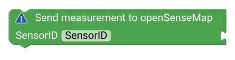
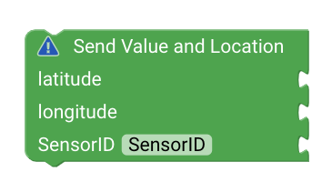

# senseBox Web {#head}

Hier findest du alle Blöcke, die eine Verbindung zum Internet benötigen. Mithilfe der Blöcke kannst du die Verbindung herstellen und Messwerte an die [openSenseMap](https://opensensemap.org) übertragen.

    

        

            
        

        

            <h4>WiFi Bee</h4>
            <!-- Button trigger modal -->
            <button type="button" class="btn-modal" data-toggle="modal" data-target="#bee1Modal">
                Anschluss: XBee1
            </button>

            <!-- Modal -->
            

                

                    

                        

                            <h5 class="modal-title" id="bee1ModalLabel">Anschluss: Xbee1</h5>
                            <button type="button" class="close" data-dismiss="modal" aria-label="Close">
                                &times;
                            </button>
                        

                        

                            
                        

                        

                            <button type="button" class="btn btn-modal" data-dismiss="modal">Schließen</button>
                        

                    

                

            

             
           Stecke das Wifi Bee auf den Xbee Steckplatz 1, um eine Verbindung mit einem verfügbarem Wlan Netzwerk herzustellen. 
        

    

  

    

        

            
        

        

            <h4>Wlan Verbindung herstellen</h4>
            Verwende diesen Block im Setup() um eine Wlan Verbindung herzustellen. Trage den entsprechenden Netzwerknamen (SSID) und
            das Passwort ein.
        

    

    

        

            
        

        

            <h4>Übertragen der Messwerte an die openSenseMap</h4>
            Um Messwerte über Internet zu übertragen erstelle zunächst eine neue Messstation auf der
            <a href="https://opensensemap.org/register">openSenseMap</a> Bei der Registrierung musst du angeboten ob es ich um eine stationäre oder mobile Station (benötigt
            GPS) handelt. Desweiteren wirst du gefragt, welche Sensoren und welche Messwerte du an die Plattform senden möchstest.
            Du kannst diese Parameter nach immer wieder ändern, falls du möchtest. Wichtig ist, dass du die BoxID kopierst
            und in diesen Block einfügst. Damit werden die Messwerte deiner senseBox zugeordnet.
        

    

    

        

            
        

        

            <h4>stationäre senseBox</h4>
            Verwende diesen Block, wenn du eine stationäre senseBox registriert hast. Für jeden Messwert benögtist du jeweils einen eigenen
            Block, denn jeder Sensor/Messwert erhält zusätzlich zur senseBox ID eine spezifische und einmalige Sensor ID.
            Kopiere die jeweilige Sensor ID aus der Übersicht deiner Registrierung und hänge eine Messwert an, der Übertragen
            werden soll. Ziehe diesen Block in die Schleife des Blocks, der eine Verbindung zur openSenseMap herstellt.
        

    

    

        

            
        

        

            <h4>mobile senseBox</h4>
            Verwende diesen Block, wenn du eine stationäre senseBox registriert hast. Für jeden Messwert benögtist du jeweils einen eigenen
            Block, denn jeder Sensor/Messwert erhält zusätzlich zur senseBox ID eine spezifische und einmalige Sensor ID.
            Kopiere die jeweilige Sensor ID aus der Übersicht deiner Registrierung und hänge eine Messwert an, der Übertragen
            werden soll. Zusätzlich zum Messwert muss jedes mal dein Standort übertagen werden. Verwende hierzu den
            <a href="../bloecke/sensebox_sensoren.html">GPS Sensor</a>. Ziehe diesen Block in die Schleife des Blocks, der eine Verbindung zur openSenseMap herstellt.
        

    

    

        

            
        

        

            <h4>Messintervall</h4>
            Damit das Übertragen der Messwerte nicht jede Sekunde erfolgt, sondern erst nach einem gewissen Zeitintervall, kannst du diesen
            Block verwenden. Ziehe dazu alle Aktionen, die erste nach einer gewissen Zeit erfolgen sollen in die Schleife und trage die Zeit in Millisekunden ein. 
        

    

