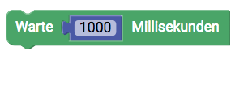
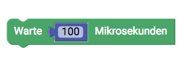
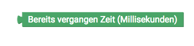
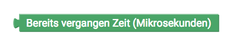
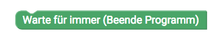
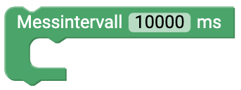

#  Zeit {#head}

     
     

    

        

            
        

        

            <h4>Programmcode unterbrechen</h4>
            Mit diesem Block kannst du deinen Programmcode für eine gewisse Zeit unterbrechen. In dieser Zeit pausiert der Mikrokontroller und es werden keine Aktionen ausgeführt. Die Zeit wird in Millisekunden angegeben (1 Sekunde = 1000 Millisekunden)
        

    

    

        

            
        

        

            Dieser Block hat die gleiche Funktion wie der vorherige Block, allerdings wird hier eine Zeit in Mikrosekunden angegeben.
        

    

    

        

            
        

        

            <h4>Bereits vergangene Zeit</h4>
            Dieser Block gibt dir die Zeit, die dein Programmcode bereits läuft. Die Laufzeit wird in Millisekunden angegeben
        

    

    

        

            
        

        

             Auch mit diesem Block wird dir die Laufzeit seit dem Start deines Programmes angegeben, diesmal allerdings in Mikrosekunden.
        

    

    

        

            
        

        

           <h4>Warte für immer</h4>
           Mit diesem Block kannst du dein Programm einfach beenden lassen.
        

    

    

        

            
        

        

            <h4>Messintervall</h4>
            Damit das Übertragen der Messwerte nicht jede Sekunde erfolgt, sondern erst nach einem gewissen Zeitintervall, kannst du diesen
            Block verwenden. Ziehe dazu alle Aktionen, die erste nach einer gewissen Zeit erfolgen sollen in die Schleife und trage die Zeit in Millisekunden ein. 
        

    

