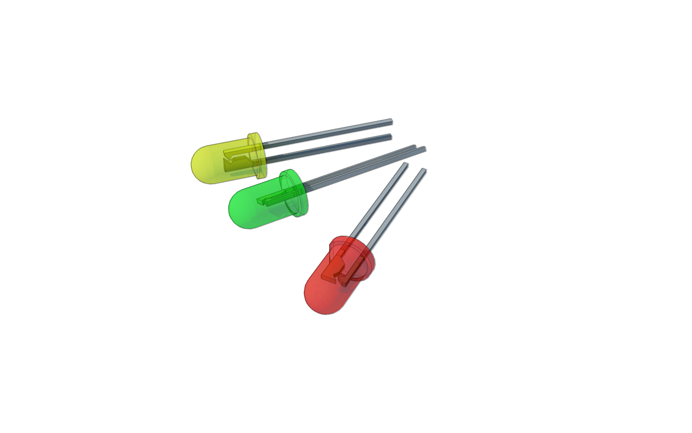

# Die senseBox:edu und ihre Komponenten {#head}
 

     
     

## Übersicht über die Komponenten

### Die senseBox MCU

Die senseBox MCU ist das Herzstück der senseBox und besitzt eine Vielzahl von Anschlussmöglichkeiten. 

### Sensoren

    

        

                <h4>Temperatur und Luftfeuchtigkeitssensor</h4>
                
                
Anschluss: I2C/Wire Ports

        

        

                <h4>Helligkeit und UV-Sensor</h4>
                
                
Anschluss: I2C/Wire Ports

        

        

                <h4>Luftdruck und Temperatursensor</h4>
                
                
Anschluss: I2C/Wire Ports

        

        

                <h4>Ultraschall-Distanssensor</h4>
                
                
Anschluss: Digital/Analog Ports

        

        

                <h4>Mikrofon</h4>
                
                
Anschluss: Digital/Analog Ports

        

    

### Kabel 

Um die Sensoren und weiteren elektronischen Bauteile mit der senseBox MCU zu verbinden werden verschiedenen Kabel verwendet. 

    

            

                    <h4>JST-JST Kabel</h4>
                    
                    
Mit den JST-JST Kabeln werden die Umweltsensoren direkt mit der senseBox MCU verbunden

            

            

                    <h4>JST-Adapterkabel</h4>
                    
                    
Um die senseBox MCU und weiteren Komponenten über das Breadboard zu verbinden werden die JST-Adapterkabel verwendet

            

            

                    <h4>Steckkabel</h4>
                    
                    
Diese Kabel werden für Schaltungen auf dem Breadboard benötigt

            

    
    

### Display und Bees

        

                

                        <h4>OLED-Display</h4>
                        
                        
Anschluss: I2C/Wire

                

                

                        <h4>WiFi-Bee</h4>
                        
                        
Anschluss: Steckplatz XBEE1

                

                

                        <h4>mSD-Bee</h4>
                        
                        
Anschluss: Steckplatz XBEE2

                

        
    
    

### Elektronische Bauteile

        

                

                        <h4>10kOhm Widerstand</h4>
                        
                        

                

                

                        <h4>470 Ohm Widerstand</h4>
                        
                

                

                        <h4>LEDs</h4>
                        
                

                

                        <h4>RGB-LED</h4>
                        
                

                

                        <h4>LDR</h4>
                        
                

                

                        <h4>Piezo</h4>
                        
                

        
    
    

### Erweiterungen

Für die senseBox sind verschiedenen Erweitungsmodule erhältlich, die direkt mit den Steckplätzen der senseBox MCU verbunden werden und über Blockly programmiert werden können. 

        

                

                        <h4>Feinstaubsensor</h4>
                        
                        
Anschluss: UART/Serial Ports

                        
Der Feinstaubsensor kann Feinstaub in zwei verschiedenen Größen messen. 

                

                

                        <h4>GPS</h4>
                        
                        
Anschluss: I2C/Wire Ports

                        
Das GPS-Modul kann dazu verwendet werden um den Standort zu bestimmen. 

                

        
    
    

