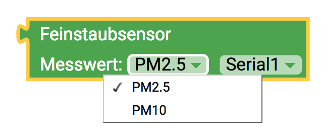

# Übersicht aller Blöcke {#head}

Hier findest du eine Übersicht über die verschiedenen Blöcketypen.

     
     

#### Verschiedene Blocktypen

Es gibt verschiedene Typen von Blöcken:

    

        

            

        

        <h4>Blöcke mit Rückgabewerten</h4>
            Diese Blöcke müssen immer an andere Blöcke angehangen werden. Sie geben einen Wert zurück (z.B. ein Messwert)
         

    

    

        

            

        

        <h4>Blöcke mit Schleifen</h4>
            In diese Blöcke kannst du verschiedene Aktionen hinziehen, die dann nacheinander ausgeführt werden.  
         

    

    

        

            

        

        <h4>Blöcke mit Kontextmenü</h4>
            Einige Blöcke haben ein kleines Zahnrad an der Seite. Mit einem Klick auf das Zahnrad kannst du das Kontexmenü öffnen und den Block um weitere Funktionen erweitern.
         

    

    

        

            

        

        <h4>Blöcke mit Dropdownmenü</h4>
            Das Dropdown Menü eines Blockes gibt dir Zugriff auf weitere Funktionen und Rückgabewerte. So kann bei Sensoren zum Beispiel ausgewählt werden welcher Messwert zurückgegeben wird oder an welchen Anschluss der Sensor angeschlossen wurde.
         

    

     
     

Eine genauere Erläuterungen zu den Blöcken, die du in der Toolbox findest gibt es auf der jeweiligen Unterseite. 

* [senseBox Sensoren](../bloecke/sensebox_sensoren.md)
* [senseBox Display](../bloecke/sensebox_display.md)
* [senseBox Ausgabe](../bloecke/sensebox_ausgabe.md)
* [Logik](../bloecke/logik.md)
* [Schleifen](../bloecke/schleifen.md)
* [Mathematik](../bloecke/mathematik.md)
* [Text](../bloecke/text.md)
* [Variablen](../bloecke/variablen.md)
* [Funktionen](../bloecke/funktionen.md)
* [Eingang/Ausgang](../bloecke/eingang_ausgang.md)
* [Zeit](../bloecke/zeit.md)

