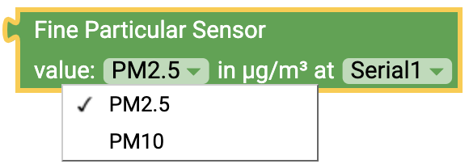

# Overview {#head}

Here you will find an overview of the different block types.

     
     

#### Various block types

There are different types of blocks:

    

        

            

        

        <h4>Blocks with return values </h4>
            These blocks must always be attached to other blocks. They return a value (e.g. a measured value).
         

    

    

        

            

        

        <h4>Blocks open block sections</h4>
            You can drag various actions into these blocks, which are then executed one after the other.  
         

    

    

        

            

        

        <h4>Blocks with context menu</h4>
            Some blocks have a small gear on the side. With a click on the gear you can open the context menu and extend the block with further functions.
         

    

    

        

            

        

        <h4>Blocks with drop down menu</h4>
            The dropdown menu of a block gives you access to further functions and return values. For example, you can select which measured value is returned or to which connection the sensor has been connected.
         

    

     
     

A more detailed explanation of the blocks you can find in the toolbox can be found on the respective subpage. 

* [Sensors](../blocks/sensoren.md)
* [Display](../blocks/display.md)
* [Web](../blocks/web.md)
    - [WiFi](../blocks/wifi.md)
    - [openSenseMap](../blocks/opensensemap.md)
    - [Webserver](../blocks/webserver.md)
* [SD](../blocks/sd.md)
* [Logic](../blocks/logik.md)
* [loops](../blocks/loops.md)
* [Mathematics](../blocks/mathematik.md)
* [Text](../blocks/text.md)
* [Variables](../blocks/variablen.md)
* [Functions](../blocks/funktionen.md)
* [Input/Output](../blocks/input_output.md)
* [Time](../blocks/zeit.md)

