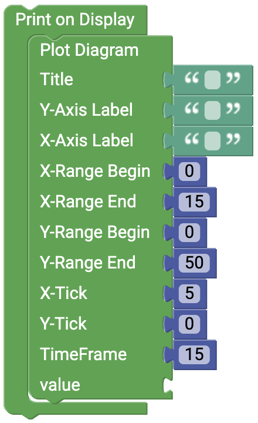

# senseBox Display {#head}

 This page provides you an overview of the different possibilities of the senseBox display.

     
     

    

        

            
        

        

            <h4>The OLED-Display</h4>
            <h6>Connection: I2C/Wire</h6>
            The OLED-DISPLAY has a resolution of 128x64 pixels and is connected via the I2C connector. To use the display it must be initialized in Setup().
        

    

    

    

        

            
        

        

            <h4>Show on the display</h4>
            This block is always required if something is to be shown on the display. In the open block section, for example, the block for displaying text is inserted. 
        

    

    

    

        

            
        

        

            <h4>Clear display</h4>
            Use this block to delete the contents of the display. At the beginning or end of the infinite loop it is recommended to use this Block to ensure correct display of e.g. measured values.
        

    

    

    

        

            
        

        

            <h4>Display Text</h4>
            With this block you can display text and measured values on the display. By default, the font color is set to
            White, because the display has a black background. You can set the font size as well as the font color.
            Change In font size 1, a letter or a number is 8 pixels in size and you can change the total size in 8 lines
            to show various texts on the display. In font size 2, the letters or numbers are 16 pixels
            high. With the X and Y values you indicate where something is shown on the display.
        

    

    

        

            
        

        

            <h4>Draw Point</h4>
        With this block a dot can be shown on the display. You can use the coordinates to place the point on the display and the radius to determine the size.     
        

    

    

        

            
        

        

            <h4>Draw Rectangle</h4>
            This block draws a rectangle on the display. The X and Y coordinates determine the position of the upper left corner of the rectangle on the display. The height and width are given in pixels and with the checkbox "Fill" you can select whether the rectangle is filled or only displayed as a frame.
        

    

 

    

        

            
        

        

            <h4>Plot Diagram</h4>
            Use this Block to Plot a Diagram on the OLED Display 
        

    

