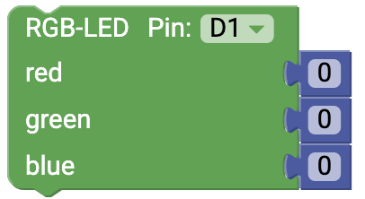

# LED {#head}

This page gives you an overview of the different output possibilities of the senseBox

     
     

    

        

            
        

        

            <h4>The LED</h4>
            <h6>Connection: Digital</h6>
            The simplest output option is controlled via the connection of an LED. Select the correct pin in the dropdown menu.
            off and the status of the LED
             
            <!-- Button trigger modal -->
            <button type="button" class="btn-modal" data-toggle="modal" data-target="#ledModal">
                gears
            </button>

            <!-- Modal -->
            

                

                    

                        

                            <h5 class="modal-title" id="ledModalLabel">Circuit - LED</h5>
                            <button type="button" class="close" data-dismiss="modal" aria-label="Close">
                                &times;
                            </button>
                        

                        

                            
                        

                        

                            <button type="button" class="btn btn-modal" data-dismiss="modal">Close</button>
                        

                    

                

            

        

    

    

        

            
        

        

            <h4>The RGB LED </h4>
            <h6>Connection: Digital</h6>
            The RGB LED can display different colors. The color always consists of the color values red, green, blue. In this way, all possible colors can be created. 

               <!-- Button trigger modal -->
               <button type="button" class="btn-modal" data-toggle="modal" data-target="#rgb-ledModal">
                gears
            </button>

            <!-- Modal -->
            

                

                    

                        

                            <h5 class="modal-title" id="rgb-ledModalLabel">circuit RGB-LED</h5>
                            <button type="button" class="close" data-dismiss="modal" aria-label="Close">
                                &times;
                            </button>
                        

                        

                            
                        

                        

                            <button type="button" class="btn btn-modal" data-dismiss="modal">Close</button>
                        

                    

                

            
       
        

    

