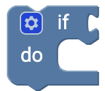
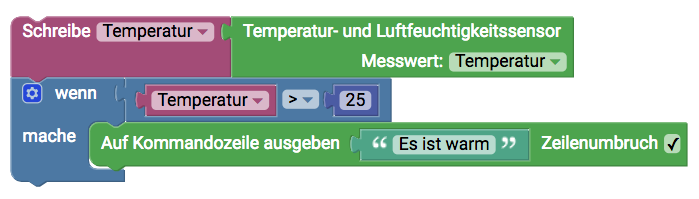
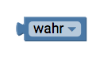
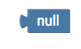
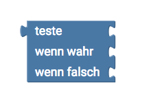

# Logik {#head}

Wenn-Dann Bedingungen sind bei der Programmierung eines der wichtigsten Elemente um dein Programmcode zu steuern. Mit Wenn-Dann kannst du zum Beispiel folgendes ausdrücken: 
<ul>
<li><b>Wenn</b> Temperatur kleiner als 20 Grad, <b>Dann</b> die Heizung an</li>
<li><b>Wenn</b> kein Wlan signal, <b>Dann</b> speichere die Messwerte auf SD-Karte</li>
</ul>

     
     

    

        

            
        

        

            <h4>Wenn-Dann</h4>
            Mit der Wenn dann Bedingung kannst du deinen Programmcode steuern und Bestimmte Aktionen ausführen lassen, <b>wenn</b> ein Bestimmter Status eingetreten ist. Um den Wenn-Dann Block zu verwenden musst du immer eine Vergleichsbedingung hinzufügen
        

    

    

        

            
        

        

            <h4>Wenn-Dann Erweiterungen</h4>
            Die Normale Wenn dann Bedingung kann mit einem Klick auf das Zahnrad erweitert werden. Du kannst noch weitere Bedinungen durch Klicken und Ziehen an die normale Wenn-Dann Bedinungen hinzufügen um weitere Bedingungen zu überprüfen oder eine andere Aktion ausführen zu lassen, falls die Wenn-Dann Bedingung nicht eintritt. Nach dem Bearbeiten kann mit einem weiteren Klick auf das Zahnrad das Fenster wieder geschlossen werden.
        

    

    

        

            
        

        

            <h4>Vergleichsbedingung</h4>
            Dieser Block wird an die Wenn-Dann Bedingungen angehangen und ermöglicht das Vergleichen von zwei 
        

    

    

        

            
        

        

            <h5>Beispiel</h5>
            So sieht zum Beispiel ein Block aus, der die Temperatur ausliest und in der Variable Temperatur gespeichert. In der Wenn Dann Bedinung wird die Variable mit der Zahl 25 verglichen und falls die Temperatur größer als 25 ist wird auf der Kommadozeile "Es ist warm" ausgeben. Tritt die Bedinungen nicht ein wird der Programmblock einfach ignoriert und das Programm wird weiter ausgeführt. 
        

    

    

        

            
        

        

            <h4>Headline</h4>
            Beschreibung
        

    

    

        

            
        

        

            <h4>Headline</h4>
            Beschreibung
        

    

    

        

            
        

        

            <h4>Headline</h4>
            Beschreibung
        

    

