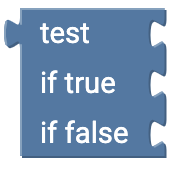

# Logic {#head}

The If condition plays an essential part in directing your code. With If this can be expressed for instance: 
<ul>
<li><b>If</b> Temperature less than 20 degrees <b>do</b> radiator on</li>
<li><b>If</b> no Wi-Fi reception, <b>do</b> save measurements on SD-Card</li>
</ul>

     
     

    

        

            
        

        

            <h4>If</h4>
            With <b>if</b> you can direct your code to execute certain actions <b>if</b> a certain event occured. To execute an  <b>if</b> statement a comparison has to be set.
        

    

    

        

            
        

        

            <h4>If/Then Expansions</h4>
            You can expand your if-statement with a click on the settings button inside the block. You can add additional statements or actions by click & drag. After you have finished editing your if-statement close you can close the settings menu with a click on the settings button.
        

    

    

        

            
        

        

            <h4>Comparison</h4>
            This block will be appended to the if-statement and lets you compare two or more statements.
    

    

        

            
        

        

            <h5>Example</h5>
            This is how an if-statement can look like. The temperature is measured and stored in the variable temperature. Next the if-statement examines if the temperature is above 25 degrees. If the temperature is above 25 degrees, the text "It is warm" will be printed on the terminal. If the temperature is below 25 degrees nothing will happen and the programm continues as is. 
        

    

    

        

            
        

        

            <h4>Headline</h4>
            Beschreibung
        

    

    

        

            
        

        

            <h4>Headline</h4>
            Beschreibung
        

    

    

        

            
        

        

            <h4>Headline</h4>
            Beschreibung
        

    

