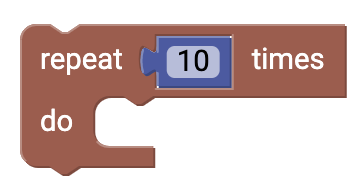
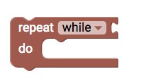
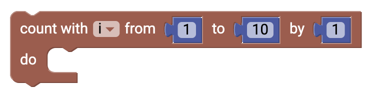
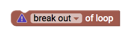

# Schleifen {#head}

Loops are an easy element for control in your code. With a loop you can control how often a specific action should be executed.

     
     

    

        

            
        

        

            <h4>Repeat x times</h4>
            You can use this block if you want a certain action to be repeated x amount of times.
        

    

    

        

            
        

        

            <h4>Repeat while</h4>
            With this block you can repeat a certain action <i>while<i> a statement is true. In order for this to work you have to add a comparison statement. 
        

    

    

        

            
        

        

            <h4>For-Loop</h4>
            This block displays the typical for-loop in programming. With the count i and the range (e.g.:1-10) and a counter you can precisely control how often an action should be executed. 
        

    

    

        

            
        

        

            <h4>Abort loop</h4>
            This block aborts the current loop. Keep in mind that only your loop will be aborted not your code itself. In the dropdown you can choose additional settings such as <i>continiuing with the next iteration of the loop.

    

