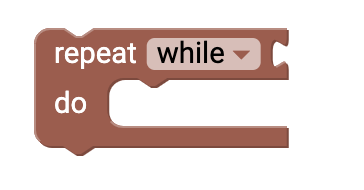

# Loops {#head}

loops are a simple control for your program code. With a loop you can control how often certain actions should be executed.

     
     

    

        

            
        

        

            <h4>Repeat X-Mal</h4>
            You can use this block if you want to perform a certain action repeatedly. You can use the number to specify how often the action should be repeated within the loop. 
        

    

    

        

            
        

        

            <h4> Repeat as long as</h4>
            With this block you can repeat a certain action, <i>as long as</i> a condition is TRUE. Add a <a href="../blocks/logik.html">comparison condition</a> to this block. In the dropdown menu you also have the option to repeat the action to <i>bis</i> the comparison condition was. 
        

    

    

        

            
        

        

            <h4>For loop</h4>
            This block describes the typical for loop in programming. With the help of a run variable <i>i</i> and a runtime range (e.g. 1-10) and a step size, it is possible to control exactly how often and which action should be executed. 
        

    

    

        

            
        

        

            <h4>Cancel loop </h4>
            This block ensures that the current loop is aborted immediately and the program code continues to run. In the dropdown menu you can also select <i> to continue with the next iteration of the loop</i>.
        

    

