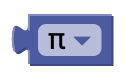
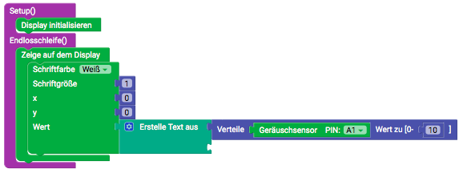

# Mathematics {#head}

With the "Math" blocks you can set values and perform various calculations.

     
     

    

        

            

        

        <h4>number</h4>
            With the value block you can transfer numbers to another block. In this block you can only enter numbers, letters or special characters are not accepted.
         

    

    

        

            

        

            <h4>Calculation</h4>
            With this block you can add, subtract, multiply, divide or potentiate numbers. This block can only be used with other blocks whose input values are numbers (e.g. the value block).
        

    

    

        

            
        

        

            <h4>Mathematical functions </h4>
            With this block you can calculate some mathematical functions. This block also only works with another block whose input value is a number.
        

    

    

        

            
        

        

            <h4>constants</h4>
            With this block you can add some mathematical constants.
        

    

    

        

            
        

        

            <h4>Rise "Element" by </h4>
            With this block you can increase the value of a numeric variable by a certain amount.
        

    

    

        

            
        

        

            <h4>laps</h4>
            With this block you can round values. During rounding, the decimal places are set to 0. Depending on the size of the decimal places, the values are automatically rounded up or down. However, you can also set that the decimal places are always rounded up or down.
        

    

    

        

            
        

        

            <h4>Limit</h4>
            This block ensures that certain limit values are not exceeded. Three values must be entered:
            <ul>
                <li>The value to be checked</li>
                <li>The lower limit</li>
                <li>The upper limit</li>
            </ul>

        

    

    

        

            
        

        

            <h4>rest of</h4>
            This block does a division and spends the rest on you.
        

    

    

        

            
        

        

            <h4>Number properties</h4>
            You can use this block to check whether a entered number has a certain property.
        

    

    

        

            
        

        

            <h4>Trigonometric functions </h4>
            With this block you can calculate sine, cosine and tangent as well as the corresponding subfunctions. Note that the input values are in radians and not in degrees.
        

    

    

        

            
        

        

                <h4>Distributed value (mapping)</h4>
                With this block you can transfer values from one value range to another. To do this, you must enter a value to be distributed and a new value range. 
                
                <button type="button" class="btn-modal" data-toggle="modal" data-target="#Modal-Display-Example">
                    Distributed Value Example
                </button>
    
                <!-- Modal begin -->
                

                    

                        

                            

                                <h5 class="modal-title" id="ModalLabelDisplayExample">Verteile-Value Example</h5>
                                <button type="button" class="close" data-dismiss="modal" aria-label="Close">
                                    &times;
                                </button>
                            

                            

                                

                                   In this example, the analog noise sensor is read out. First, the measured analog values (value range from 0 to 1023) are displayed directly.
                                   

                                        <h6 align="center">blocks without distribution</h6>
                                        
                                    

                                    

                                        <h6 align="center">Display Display without distribution</h6>
                                        
                                    

                                

                                

                                    Here, the measured values are additionally transferred by the distribution value block into a new value range from 0 to 10.
                                    

                                        <h6 align="center">Blocks with distribution</h6>
                                        
                                    

                                    

                                        <h6 align="center">Display Display with distribution</h6>
                                        
                                    

                                

                            

                            

                                <button type="button" class="btn btn-modal" data-dismiss="modal">Close</button>
                            

                        

                    

                

            

    

    

        

            
        

        

            <h4>Random number</h4>
            This block determines a random number between 0.0 and 1.0.
        

    

        

    

    

        

            
        

        

            <h4>Integer random number </h4>
            This block can be used to generate integer random values within self-defined limits.
        

    

