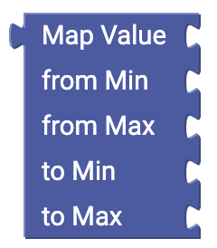
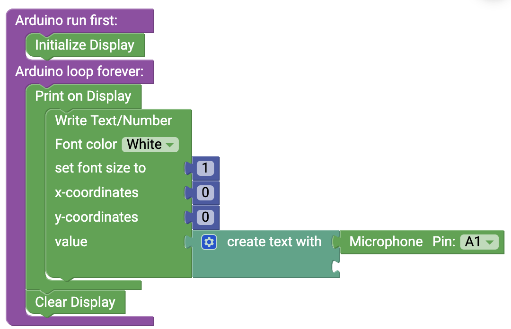

# Mathematics {#head}

With the mathematics blocks you can assign values and do various calculations.

     
     

    

        

            

        

        <h4>Value</h4>
            Use this block to transmit values (numbers) to another Block.
         

    

    

        

            

        

            <h4>Calculate</h4>
            Use this block to sum, substract, multiplicate, divide or exponentiate numbers.
        

    

    

        

            
        

        

            <h4>Mathematic operations</h4>
            Use this block to perform mathematic operations, e.r. square root.
        

    

    

        

            
        

        

            <h4>Constant</h4>
            Use this block to insert some mathematical constants to your code.
        

    

    

        

            
        

        

            <h4>The increase block</h4>
            With this block you increase the value of a numeric variable by a certain value.
        

    

    

        

            
        

        

            <h4>The round block</h4>
            With this block you can round values. The round block the decimal numbers are set to 0. Depending on the value, the value is rounded down or up. Either way, you can choose if you want to round down or up in the settings menu.
        

    

    

        

            
        

        

            <h4>The range block</h4>
            With this block you can assign a range. Three values have to be set:
            Dieser Block sorgt dafür, dass bestimmte Grenzwerte nicht überschritten werden. Dazu müssen drei Werte eingegeben werden:
            <ul>
                <li>The examined value</li>
                <li>The lower limit</li>
                <li>The upper limit</li>
            </ul>

        

    

    

        

            
        

        

            <h4>The Rest block</h4>
            This block executes a division and returns the rest.
        

    

    

        

            
        

        

            <h4>The number properties block</h4>
            With this block you can check if a given number has certain properties.
        

    

    

        

            
        

        

            <h4>The trigonometric functions block</h4>
            With this block you can calculate sinus, cosinus and tangens with the corresponding sub-functions. Keep in mind to give the values in radians and not in degrees.
        

    

    

        

            
        

        

                <h4>The distribute values block</h4>
                With this block you can distribute values from a value range to another. To do this you have to give a to be distributed value and a new range. 
                
                <button type="button" class="btn-modal" data-toggle="modal" data-target="#Modal-Display-Example">
                    distribute values example
                </button>
    
                <!-- Modal begin -->
                

                    

                        

                            

                                <h5 class="modal-title" id="ModalLabelDisplayExample">distribute values example</h5>
                                <button type="button" class="close" data-dismiss="modal" aria-label="Close">
                                    &times;
                                </button>
                            

                            

                                

                                    In this example the analog noise sensor is checked. First die measured analog values (Range from 0 bis 1023) will be displayed.
                                   

                                        <h6 align="center">Blöcke ohne Verteilung</h6>
                                        
                                    

                                    

                                        <h6 align="center">Display Anzeige ohne Verteilung</h6>
                                        
                                    

                                

                                

                                    Here the measured values will be distributed to the new range of 0 to 10.
                                    

                                        <h6 align="center">Blöcke mit Verteilung</h6>
                                        
                                    

                                    

                                        <h6 align="center">Display Anzeige mit Verteilung</h6>
                                        
                                    

                                

                            

                            

                                <button type="button" class="btn btn-modal" data-dismiss="modal">Close</button>
                            

                        

                    

                

            

    

    

        

            
        

        

            <h4>The random numbers block</h4>
            This block returns a random number from 0.0 to 1.0
        

    

        

    

    

        

            
        

        

            <h4>The advanced random numbers block</h4>
            This block returns a random whole number in the given range.
        

    

