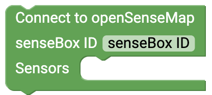
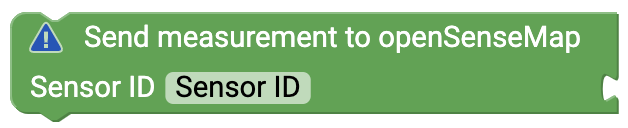
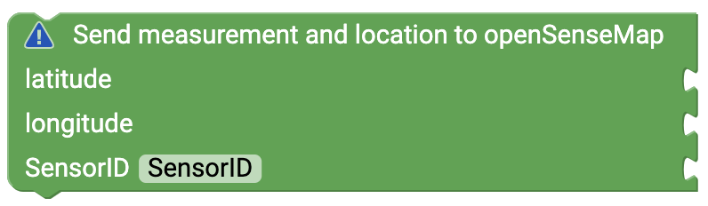

# openSenseMap {#head}

 Using the blocks you can establish a connection to <a href="https://opensensemap.org">openSenseMap</a> and readings.
To transfer measurements to the openSenseMap you first have to create a user account and a new senseBox. You can find out exactly how to do this here: 

    

        

            
        

        

            <h4>Transmit measured values to the openSenseMap</h4>
            To transmit measured values via the Internet, first create a new measuring station on the
            <a href="https://opensensemap.org/register">openSenseMap</a> When registering, you must be offered whether it is a stationary or mobile station (required
            GPS). Furthermore you will be asked which sensors and which measured values you want to send to the platform.
            You can change these parameters again and again if you want. It is important that you copy the BoxID.
            and insert it into this block. This assigns the measured values to your senseBox.
        

    

    

        

            
        

        

            <h4>Stationary senseBox</h4>
            Use this block if you have registered a stationary senseBox. For each measured value you will need a separate
            Block, because each sensor/measured value receives a specific and unique sensor ID in addition to the senseBox ID.
            Copy the respective sensor ID from the overview of your registration and append a measured value, which will be transferred to the sensor.
            to be. Drag this block into the loop of the block that connects to the openSenseMap.
        

    

    

        

            
        

        

            <h4>mobile senseBox</h4>
            Use this block if you have registered a stationary senseBox. For each measured value you will need a separate
            Block, because each sensor/measured value receives a specific and unique sensor ID in addition to the senseBox ID.
            Copy the respective sensor ID from the overview of your registration and append a measured value, which will be transferred to the sensor.
            to be. In addition to the measured value, your location must be transferred each time. Use the
            <a href="../blocks/sensoren.html#gps">GPS Sensor</a>. Drag this block into the loop of the block that connects to the openSenseMap.
        

    

