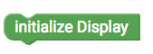

# senseBox Display {#head}

 This Site give you an overview about the different possibilities with the senseBox Display.

     
     

    

        

            
        

        

            <h4>The OLED-Display</h4>
            <h6>Connection: I2C/Wire</h6>
            The
            <a href="../uebersicht/sensebox_components.html#temp_humi">OLED-DISPLAY</a> has a Resolution of 128 by 64 and will be connected via the I2C/Wire connectors. The Display need to be initialise first in the setup().
        

    

    

        

            
        

        

            <h4>Show on  display</h4>
            Use this Block to show content on the display. In this loop you can either use the Block to plot a diagram or the Block to print text or values.
        

    

    

        

            
        

        

            <h4>Clear Display</h4>
            Use this Block to clear to complete display content. Verwende diesen Block um den Inhalt des Displays zu löschen. It is recommended to clear the display at the bevor or after the "Show on Display" loop to ensure measured values being displayed correctly.
        

    

    

        

            
        

        

            <h4>Print Text</h4>
            With this block you can display text and measured values on the display. The font color is set to "white" by default as the display has a black background. You can also change the font size in addition to the font color. In font size 1 a letter or number is 8 pixel tall and you can display 8 lines in total on the display. In font size 2 the letters and numbers are 16 pixels tall. With the X and Y values you can indicante where on the display something it is displayed.

            <button type="button" class="btn-modal" data-toggle="modal" data-target="#Modal-Display-Example">
                Display Examples
            </button>

            <!-- Modal begin -->
            

                

                    

                        

                            <h5 class="modal-title" id="ModalLabelDisplayExample">Display Examples</h5>
                            <button type="button" class="close" data-dismiss="modal" aria-label="Close">
                                &times;
                            </button>
                        

                        

                            

                                

                                    <h6 align="center">Block</h6>
                                    
                                

                                

                                    <h6 align="center">Display Anzeige</h6>
                                    
                                

                            

                        

                        

                            <button type="button" class="btn btn-modal" data-dismiss="modal">Close</button>
                        

                    

                

            

        

    

    

        

            
        

        

            <h4>Plot Diagrams</h4>
            With this block you can create diagrams out of measured values on the display.
        

    

