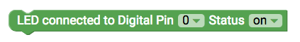
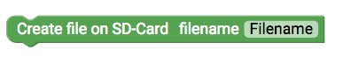
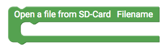
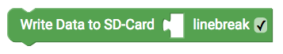
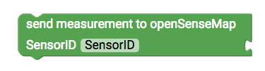
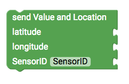
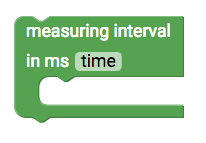

# senseBox output {#head}

This site gives an overview over the various outputs of the senseBox

     
     

    

        

            
        

        

            <h4>The LED</h4>
            <h6>Connection: Digital</h6>
            The simplest output is a LED. Choose the right PIN and the LED status in the dropdown.
             
            <!-- Button trigger modal -->
            <button type="button" class="btn-modal" data-toggle="modal" data-target="#exampleModal">
                Circuit
            </button>

            <!-- Modal -->
            

                

                    

                        

                            <h5 class="modal-title" id="exampleModalLabel">Circuit</h5>
                            <button type="button" class="close" data-dismiss="modal" aria-label="Close">
                                &times;
                            </button>
                        

                        

                            
                        

                        

                            <button type="button" class="btn btn-modal" data-dismiss="modal">Close</button>
                        

                    

                

            

        

    

    

        

            
        

        

            <h4>The Piezo</h4>
            <h6>Connection: Digital</h6>
        

    

    

        

            
        

        

            <h4>The RGB-LED</h4>
            <h6>Connection: Digital</h6>
        

    

    

        

            
        

        

            <h4>Save on SD-Card</h4>
            <h6>Connection: XBEE2</h6>
            Saving data to the SD-Card different Blocks were needed. The first step is to create a file with a filename in the Setup()
        

    

    

        

            
        

        

            This Block allows to open the file in den loop() to write data.
        

    

    

        

            
        

        

            After opening the file in the loop() you can use this Block to write measurment values or text. Use the checkbox apply a linebrake in the file after writing. It is recommended to seperate values with a seperator e.g. a comma or semikolon. Use the Text Blocks for it.
        

    

    

        

            
        

        

            <h4>print on serial monitor</h4>
            If you want to see values or text withou atteching the Display you can use this command to start the serial monitor and write Values. Note: To use this functionality you need to have the Arduino IDE installed to your computer!
        

    

    

        

            
        

        

            <h4>Setup wifi connection</h4>
            <h6>Connection: XBEE1</h6>
            Use this Block in the setup() to connect to a wifi network. Insert the Network ID (SSID) and the Password.
        

    

    

        

            
        

        

            <h4>Transfer measurement values to the openSenseMap</h4>
            Start first with a registration on the           
            <a href="https://opensensemap.org/register">openSenseMap</a> In the registration process you have to choose between stationary and mobile (need GPS) senseBox. Furthermore you will be asked was kind of sensors you are using and which parameters you want to send to the platform. This parameter can be edited after the registration. Import: Copy your BoxID to this Block.
        

    

    

        

            
        

        

            <h4>stationary senseBox</h4>
             Use this Block if you registered a stationary senseBox. For each measurement you need a seperate Block with a specific Sensor ID. Copy the Sensor ID from the registration form and append a value. Attach this Block within the Block which setups a connection to the openSenseMap.
        

    

    

        

            
        

        

            <h4>mobile senseBox</h4>
            Use this Block if you registered a mobile senseBox. For each measurement you need a seperate Block with a specific Sensor ID. Copy the Sensor ID from the registration form and append a value. You also have to append the location to this Block, use the 
            <a href="../blocks/sensebox_sensoren.html">GPS Sensor</a> to gain latitude and longitude values. Attach this Block within the Block which setups a connection to the openSenseMap.
        

    

    

        

            
        

        

            <h4>Measurement interval</h4>
            Transmitten values each second to the openSeneMap is not sufficient. With this Block you can setup a interval timer. Everything which should be done after the interval timer need to be placed within this Block loop.
        

    

