# senseBox Sensoren {#head}

Diese Seite gibt Ihnen einen Überblick über die verfügbaren Blöcke, mit denen Sie die Sensoren der senseBox auslesen und steuern können.
    kannst

     
     

    

        

            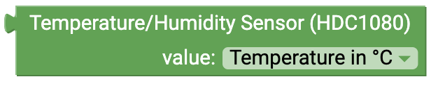
        

        

            <h4>Temperature and Humidity (HDC1080)</h4>
            <!-- Knopftrigger modal -->
            <Button type="button" class="btn-modal" data-toggle="modal" data-target="#exampleModal">
                Connection: I2C/Wire
            </button>

            <!-- Modal -->
            

                

                    

                        

                            <h5 class="modal-title" id="exampleModalLabel">Anschluss: I2C/Draht</h5>
                            <button type="button" class="close" data-dismiss="modal" aria-label="Close">
                                &times;
                            </button>
                        

                        

                            
                        

                        

                            <button type="button" class="btn btn btn-modal" data-dismiss="modal">Schließen</button>
                        

                    

                

            

             
            This Block will give the value from the
            <a href="../overview/sensebox_components.html#temp_humi">Temperature and Humiditiy</a>. You can choose between the different measurement values in the Dropdown-Menü:
            <ul>
                <li> Temperature </li>
                <li> Humidity </li>
            </ul>
        

    

    

        

            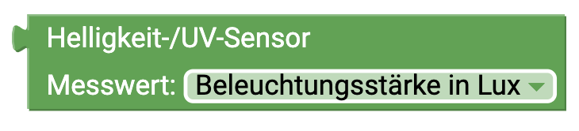
        

        

            <h4>Illuminance/UV-Sensor</h4>

            <!-- modal -->
            <Button type="button" class="btn-modal" data-toggle="modal" data-target="#i2cModal">
                Connection: I2C/Wire
            </button>

            <!-- Modal --> 
            

                

                    

                        

                            <h5 class="modal-title" id="i2cModalLabel">Connection: I2C/Wire</h5>
                            <button type="button" class="close" data-dismiss="modal" aria-label="Close">
                                &times;
                            </button>
                        

                        

                            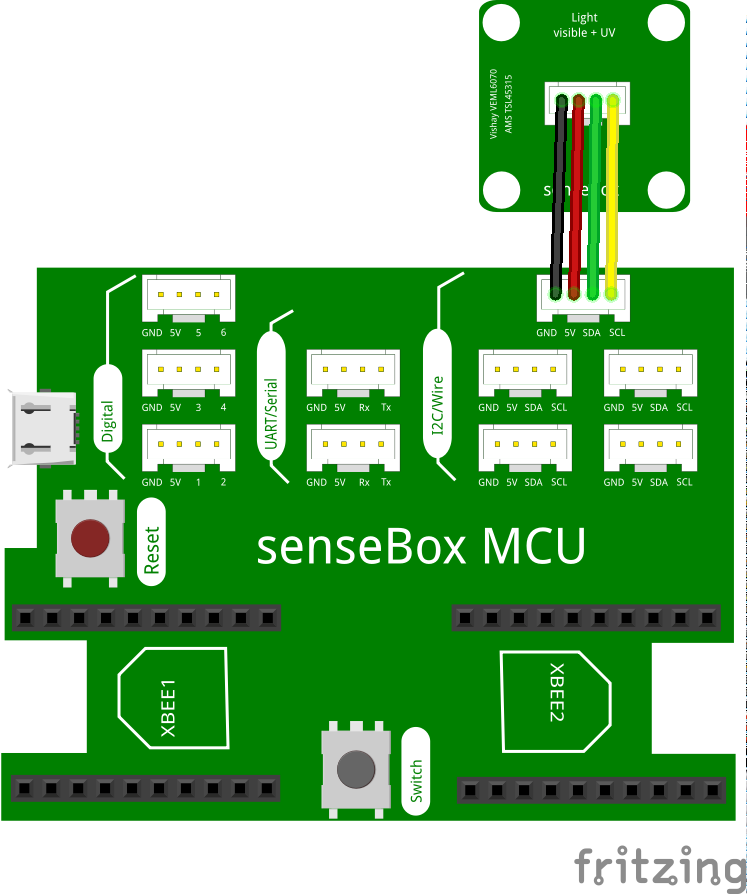
                        

                        

                            <button type="button" class="btn btn btn-modal" data-dismiss="modal">Schließen</button>
                        

                    

                

            

             
            This Block I'll be you do the messwert of
            <a href="../overview/sensebox_components.html#illu_uv">UV-Licht und Lichtsensor</a>. Im Dropdown-Menü können Sie den jeweiligen Messwert auswählen. Dropdown-Menü:
            <ul>
                <li> Illuminance</li>
                <li> UV-Light </li>
            </ul>
        

    

        

    

    

        

            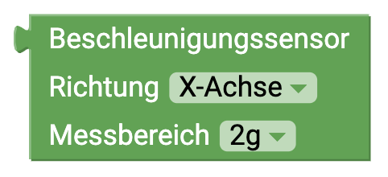
        

        

            <h4>Beschleunigungssensor</h4>
            Dieser Block gibt den Messwert der Beschleunigungssensoren der direkten auf der SenseBox MCU an. Im Dropdown-Menü können Sie den jeweiligen Messwert auswählen. Dropdown-Menü Richtung:
<ul>
                <li>x-axis</li>
                <li>y axis</li>
                <li>z-axis</li>
                <li>total</li>
            </ul>
            Dropdown measuring range:
            <ul>
                <li>2g</li>
                <li>4g</li>
                <li>8g</li>
                <li>16g</li>
            </ul>
        

    

        

    

    

        

            
        

        

            <h4>Fine dust sensor</h4>
             
            This block gives you the measured value of the<a href="../overview/sensebox_components.html#dust">fine dust sensor</a> . In the dropdown menu you can select the respective measured value. Dropdown (measured value):
            <ul>
                <li> PM10 </li>
                <li> PM2.5 </li>
            </ul>
            Dropdown:
            <ul>
                <li> Serial1 </li>
                <li> Serial2 </li>
            </ul>
        

    

    

        

            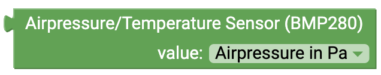
        

        

            <h4>Air Pressure/Temperature Sensor (BMP280)</h4>
            <!-- Button trigger modal -->
            <button type="button" class="btn-modal" data-toggle="modal" data-target="#i2cModal">
                Connection: I2C/Wire
            </button>

            <!-- Modal -->
            

                

                    

                        

                            <h5 class="modal-title" id="i2cModalLabel">connection: I2C/Wire</h5>
                            <button type="button" class="close" data-dismiss="modal" aria-label="Close">
                                &times;
                            </button>
                        

                        

                            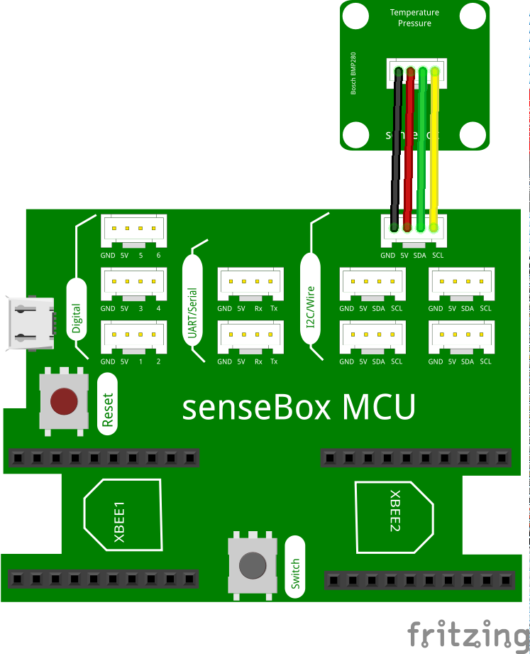
                        

                        

                            <button type="button" class="btn btn-modal" data-dismiss="modal">Close</button>
                        

                    

                

            

             
            This block gives you the measured value of the <a href="../overview/sensebox_components.html#pressure_temp">air pressure</a>. The air pressure is output by the sensor in Pascal (Pa). If you need the value in Hektopascal (hPa) divide by 100.
        

    

    

        

            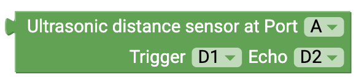
        

        

            <h4>Ultrasonic distance sensor</h4>
            <h6>Connection: Digital</h6>
            This block gives you the reading of the ultrasonic distance sensor. The measured value corresponds to the distance in centimeters.
            When connecting the sensor, be sure to select the correct pins in the dropdown menu.   
            <!-- Button trigger modal -->
            <button type="button" class="btn-modal" data-toggle="modal" data-target="#Modal-Ultrasonic">
                Circuit: Ultrasonic distance sensor
            </button>
            <!-- Modal begin -->
            

                

                    

                        

                            <h5 class="modal-title" id="ModalLabelUltrasonic">Circuit: Ultrasonic distance sensor</h5>
                            <button type="button" class="close" data-dismiss="modal" aria-label="Close">
                                &times;
                            </button>
                        

                        

                            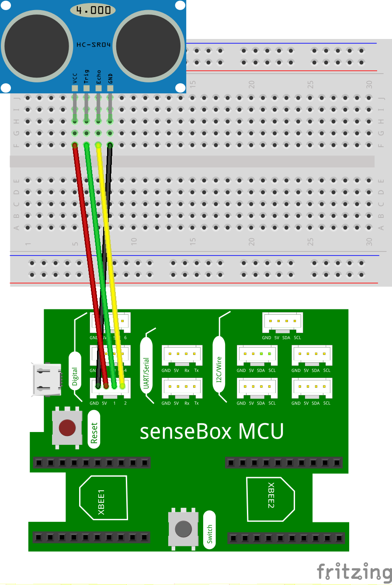
                        

                        

                            <button type="button" class="btn btn-modal" data-dismiss="modal">Close</button>
                        

                    

                

            
 <!--Modal end-->
        

    

    

        

            
        

        

            <h4>Microphone</h4>
            <h6>Connection: analog</h6>
            This block gives you the reading of the microphone. The output value is a level value between 0 and 5V.
            When connecting the sensor, be sure to select the correct pins in the dropdown menu. <!-- Button trigger modal -->
            <button type="button" class="btn-modal" data-toggle="modal" data-target="#Modal-Sound">
                Circuit: Microphone sensor
            </button>

            <!-- Modal begin -->
            

                

                    

                        

                            <h5 class="modal-title" id="ModalLabelSound">Circuit: Microphone</h5>
                            <button type="button" class="close" data-dismiss="modal" aria-label="Close">
                                &times;
                            </button>
                        

                        

                            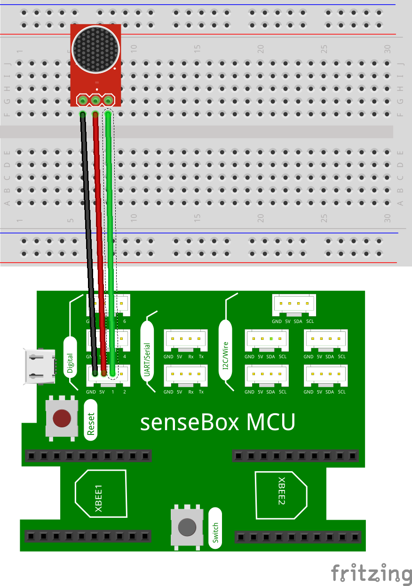
                        

                        

                            <button type="button" class="btn btn-modal" data-dismiss="modal">Close</button>
                        

                    

                

            
 <!--Modal end-->
        

    

    

        

            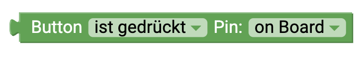
        

        

            <h4>Button</h4>
            <h6>Connection: Digital</h6>
            This block gives you the status of the connected button. In the dropdown menu you can select different modes for the button. You can control either the onboard button or a button connected to one of the 6 digital pins. 
            different modes:
            <ul>
            <li> "is pressed": With this mode you can check if the block is currently pressed. You get either TRUE or FALSE.</li>.
            <li> "was pressed": With this mode you can check if the block was pressed. Only when the button is pressed and released you get TRUE back </li>
            <li> "as switch": If you use this block you can use the button like a light switch. The status will be saved until the button is pressed again </li>
            </ul>
        

    

    

        

            
        

        

            <h4>Potentiometer</h4>
            <h6>Connection: analog</h6>
            This block gives you the reading of the potentiometer. The output value corresponds to a level between 0 and 1023.
            When connecting the sensor, be sure to select the correct pins in the dropdown menu.
        

    

    

        

            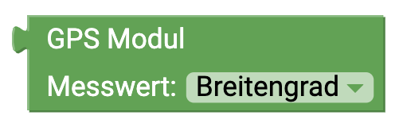
        

        

            <h4>GPS Sensor</h4>
             
            This block gives you different measured values of the
            <a href="../overview/sensebox_components.html#gps">GPS Sensors</a>. In addition to the longitude and latitude for determining the position, the sensor can also measure the height
            (in meters) and the current speed (in km/h). Dropdown:
            <ul>
                <li> Latitude </li>
                <li> Longitude </li>
                <li> Height </li>
                <li> Speed </li>
            </ul>
        

    

