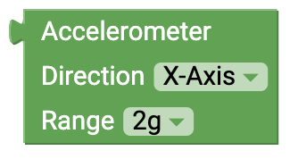
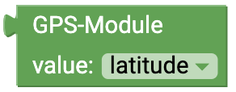

# senseBox Sensoren {#head}

Diese Seite gibt dir eine Übersicht über die Verfügbaren Blöcke mit denen du die Sensoren der senseBox auslesen und ansteuern
    kannst

     
     

    

        

            
        

        

            <h4>Temperatur-/Luftfeuchtigkeitssensor (HDC1080)</h4>
            <!-- Button trigger modal -->
            <button type="button" class="btn-modal" data-toggle="modal" data-target="#exampleModal">
                Anschluss: I2C/Wire
            </button>

            <!-- Modal -->
            

                

                    

                        

                            <h5 class="modal-title" id="exampleModalLabel">Anschluss: I2C/Wire</h5>
                            <button type="button" class="close" data-dismiss="modal" aria-label="Close">
                                &times;
                            </button>
                        

                        

                            
                        

                        

                            <button type="button" class="btn btn-modal" data-dismiss="modal">Schließen</button>
                        

                    

                

            

             
            Dieser Block gibt dir den Messwert des
            <a href="../uebersicht/sensebox_components.html#temp_humi">Temperatur und Luftfeuchtigkeitssensor</a>. Im Dropdown Menü kannst du den jeweiligen Messwert auswählen. Dropdown:
            <ul>
                <li> Temperatur </li>
                <li> Luftfeuchtigkeit </li>
            </ul>
        

    

    

        

            
        

        

            <h4>Helligkeit-/UV-Sensor</h4>

            <!-- Button trigger modal -->
            <button type="button" class="btn-modal" data-toggle="modal" data-target="#i2cModal">
                Anschluss: I2C/Wire
            </button>

            <!-- Modal -->
            

                

                    

                        

                            <h5 class="modal-title" id="i2cModalLabel">Anschluss: I2C/Wire</h5>
                            <button type="button" class="close" data-dismiss="modal" aria-label="Close">
                                &times;
                            </button>
                        

                        

                            
                        

                        

                            <button type="button" class="btn btn-modal" data-dismiss="modal">Schließen</button>
                        

                    

                

            

             
            Dieser Block gibt dir den Messwert des
            <a href="../uebersicht/sensebox_components.html#illu_uv">UV-Licht und Lichtsensor</a>. Im Dropdown Menü kannst du den jeweiligen Messwert auswählen. Dropdown:
            <ul>
                <li> UV-Licht </li>
                <li> Helligkeit </li>
            </ul>
        

    

        

    

    

        

            
        

        

            <h4>Beschleunigungssensor</h4>
            Dieser Block gibt dir den Messwert des Beschleunigungssensors der direkte auf der senseBox MCU aufgelötet ist. Im Dropdown Menü kannst du den jeweiligen Messwert auswählen. Dropdown Richtung:
            <ul>
                <li>x-Achse</li>
                <li>y-Achse</li>
                <li>z-Achse</li>
                <li>Gesamt</li>
            </ul>
            Dropdown Messbereich:
            <ul>
                <li>2g</li>
                <li>4g</li>
                <li>8g</li>
                <li>16g</li>
            </ul>

        

    

        

    

    

        

            
        

        

            <h4>Feinstaubsensor</h4>
             
            Dieser Block gibt dir den Messwert des<a href="../uebersicht/sensebox_components.html#dust">Feinstaubsensor</a> . Im Dropdown Menü kannst du den jeweiligen Messwert auswählen. Dropdown (Messwert):
            <ul>
                <li> PM10 </li>
                <li> PM2.5 </li>
            </ul>
            Dropdown:
            <ul>
                <li> Serial1 </li>
                <li> Serial2 </li>
            </ul>
        

    

    

        

            
        

        

            <h4>Luftdruck-/Temperaturssensor (BMP280)</h4>
            <!-- Button trigger modal -->
            <button type="button" class="btn-modal" data-toggle="modal" data-target="#i2cModal">
                Anschluss: I2C/Wire
            </button>

            <!-- Modal -->
            

                

                    

                        

                            <h5 class="modal-title" id="i2cModalLabel">Anschluss: I2C/Wire</h5>
                            <button type="button" class="close" data-dismiss="modal" aria-label="Close">
                                &times;
                            </button>
                        

                        

                            
                        

                        

                            <button type="button" class="btn btn-modal" data-dismiss="modal">Schließen</button>
                        

                    

                

            

             
            Dieser Block gibt dir den Messwert des <a href="../uebersicht/sensebox_components.html#pressure_temp">Luftdruck</a>. Der Luftdruck wird vom Sensor in Pascal (Pa) ausgegeben. Benötigst du den Wert in Hektopascal (hPa) teile durch 100.
        

    

    

        

            
        

        

            <h4>Ultraschall-Abstandssensor</h4>
            <h6>Anschluss: Digital</h6>
            Dieser Block gibt dir den Messwert des Ultraschall Distanzsensor. Der ausgegebene Messwert entspricht der Distanz in Zentimeter.
            Beachte beim Anschluss des Sensor auf die korrekte Auswahl der Pins im Dropdown Menü.   
            <!-- Button trigger modal -->
            <button type="button" class="btn-modal" data-toggle="modal" data-target="#Modal-Ultrasonic">
                Schaltung: Ultraschall Distanzsensor
            </button>

            <!-- Modal begin -->
            

                

                    

                        

                            <h5 class="modal-title" id="ModalLabelUltrasonic">Schaltung: Ultraschall Distanzsensor</h5>
                            <button type="button" class="close" data-dismiss="modal" aria-label="Close">
                                &times;
                            </button>
                        

                        

                            
                        

                        

                            <button type="button" class="btn btn-modal" data-dismiss="modal">Schließen</button>
                        

                    

                

            
 <!--Modal end-->
        

    

    

        

            
        

        

            <h4>Mikrofon</h4>
            <h6>Anschluss: Analog</h6>
            Dieser Block gibt dir den Messwert des Mikrofons. Der ausgegebene Messwert ist ein Pegelwert zwischen 0 und 5V.
            Beachte beim Anschluss des Sensor auf die korrekte Auswahl der Pins im Dropdown Menü.<!-- Button trigger modal -->
            <button type="button" class="btn-modal" data-toggle="modal" data-target="#Modal-Sound">
                Schaltung: Lautstärkesensor
            </button>

            <!-- Modal begin -->
            

                

                    

                        

                            <h5 class="modal-title" id="ModalLabelSound">Schaltung: Lautstärkesensor</h5>
                            <button type="button" class="close" data-dismiss="modal" aria-label="Close">
                                &times;
                            </button>
                        

                        

                            
                        

                        

                            <button type="button" class="btn btn-modal" data-dismiss="modal">Schließen</button>
                        

                    

                

            
 <!--Modal end-->
        

    

    

        

            
        

        

            <h4>Button</h4>
            <h6>Anschluss: Digital</h6>
            Dieser Block gibt dir den Status des angeschlossenen Buttons. Im Dropdown Menü können verschiedene Modi für den Button ausgewählt werden. Angesteuert können entweder der on Board Button oder ein Button, der an einen der 6 digitalen Pins angeschlossen ist. 
            verschiedene Modi:
            <ul>
            <li> "ist gedrückt": Mit diesem Modus kannst du abfragen ob der Block gerade gedrückt wird. Du erhältst entweder den Wert TRUE oder FALSE.</li>
            <li> "wurde gedrückt": Mit diesem Modus kannst du abfragen ob der Block gedrückt wurde. Erst wenn der Knopf gedrückt und wieder losgelassen wurde erhältst du TRUE zurück </li>
            <li> "als Schalter": Wenn du diesen Block verwendest kannst du den Knopf wie ein Lichtschalter verwenden. Der Status wird gespeichert bis der Button erneut gedrückt wird </li>
            </ul>
        

    

    

        

            
        

        

            <h4>Potentiometer</h4>
            <h6>Anschluss: Analog</h6>
            Dieser Block gibt dir den Messwert des Potentiometers. Der ausgegebene Messwert entspricht einem Pegel zwischen 0 und 1023.
            Beachte beim Anschluss des Sensor auf die korrekte Auswahl der Pins im Dropdown Menü.
        

    

    

        

            
        

        

            <h4>GPS Sensor</h4>
             
            Dieser Block gibt dir verschiedene Messwerte des
            <a href="../uebersicht/sensebox_components.html#gps">GPS Sensors</a>. Neben dem Längen- und Breitengrad für die Standortbestimmtung kann der Sensor auch die Höhe
            (in Meter) und die aktuelle Geschwindigkeit (in km/h) ausgeben. Dropdown:
            <ul>
                <li> Breitengrad </li>
                <li> Längengrad </li>
                <li> Höhe </li>
                <li> Geschwindigkeit </li>
            </ul>
        

    

