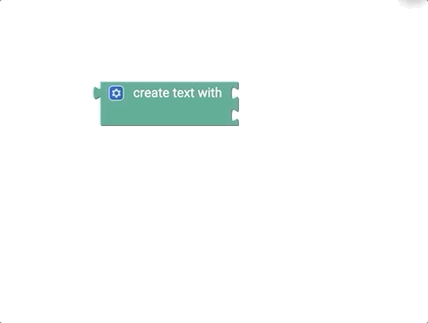

# Text {#head}

This page gives you an overview of the available blocks for creating text in Blockly for senseBox. Text, for example can be:
<ul> 
<li>one single word (e.g. name)</li>
<li>a whole sentence (e.g. Hello World!)</li>
<li>one measured value</li>
<li>a description for measured values (e.g. temperature: )</li>
</ul>

     
     

    

        

            
        

        

            <h4>The text block</h4>
        Use this block to display simple text. Write the desired text in the field between the quotation marks.
        

    

    

        

            
        

        

            <h4>The Create Text Off Block </h4>
            Use this block to display more complicated text elements. You need this block on the one hand to convert a measured value into text and on the other hand to create compound text. 
        

    

    

        

            
        

        

            <h4>Create Text Off Extensions</h4>
            The normal Create Text Off block can be extended by clicking on the gear. You can add more elements by clicking and dragging to create text from multiple elements. After editing you can close the window by clicking on the gear again.
        

    

    

        

            
        

        

            <h4>The Text Attachment Block</h4>
            Use this block to add an additional element to an existing text block.
        

    

    

        

            
        

        

            <h4>The Length Block</h4>
            Use this block to determine the length of a text block. For example, the length of the text block "senseBox" would be 8.
        

    

    

        

            
        

        

            <h4>The Blank Block</h4>
            This block checks whether a given text block is empty (has the length 0). The result is either true (if the given text block is actually empty) or false (if there are characters in the text block).
        

    

