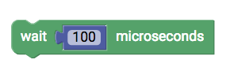
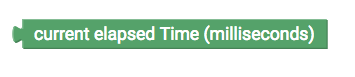
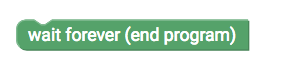

#  Zeit {#head}

     
     

    

        

            
        

        

            <h4>wait</h4>
            This block will pause the running program for a certain time.
        

    

    

        

            
        

        

        

    

    

        

            
        

        

            <h4>time elapsed</h4>
           This block returns the time your program is running.
        

    

    

        

            
        

        

        

    

    

        

            
        

        

           <h4>wait forever</h4>
        This block will pause your program forver (in fact end it).
        

    

