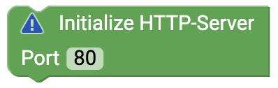
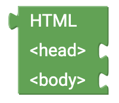

# senseBox Web {#head}

Here you can find all the blocks you need to build a webserver using senseBox. For the webserver you need the WiFi-Bee.

    

        

            
        

        

            <h4>Initialize HTTP server </h4>
            Use this block in Setup() to initialize the HTTP server. The Port field allows you to specify the port the server should be accessible from in the browser. By default, port 80 is entered here.
        

    

    

        

            
        

        

            <h4>When client is connected</h4>
            This block is connected in an endless loop. In the free block section, insert the blocks to be executed when a client (e.g. a user via the browser) accesses the server.
        

    

    

        

            
        

        

            <h4>IP address</h4>
            This block returns the IP address of your senseBox in the network.
        

    

    

        

            
        

        

            <h4>Method</h4>
            This block gives you the method back.
        

    

    

        

            
        

        

            <h4>URI</h4>
            This block gives you the URI back.
        

    

    

        

            
        

        

            <h4>User agent</h4>
            This block returns the user agent of the client accessing the HTTP server.
        

    

    

        

            
        

        

            <h4>Successful HTTP Response</h4>
            With this block you can send an HTTP response to the client when it accesses the server. The answer is the HTML code that can be assembled from different blocks. 
        

    

    

        

            
        

        

            <h4>404 error</h4>
            This block can be sent as a possible HTTP response when a faulty page is called. 
        

    

    

        

            
        

        

            <h4>HTML</h4>
            This is the basic building block for the HTML code. On the body you attach your HTML code, which describes the structure of the website.
        

    

    

        

            
        

        

            <h4>Day</h4>
            With the tags you can build your HTML page directly with Blockly. 
        

    

    

        

            
        

        

            <h4>Read HTML from SD card</h4>
            You can append this block to the basic HTML code block and load a .html file from the SD card. 
        

    

