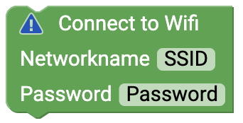
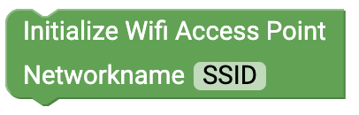

# WiFi {#head}

Here you will find all blocks that need a connection to the internet. 

To use these blocks, plug the WiFi-Bee into the XBEE1 slot.

    

        

            
        

        

            <h4>Connect to WLAN</h4>
            Use this block in Setup() to establish a Wlan connection. Write the corresponding network name (SSID) and
            enter the password.
        

    

    

        

            
        

        

            <h4>Initialize WLAN Access Point</h4>
            Use this block in Setup() to create a Wlan Access Point with the senseBox. Then a device (e.g. mobile phone or computer) can connect directly to the senseBox.
        
