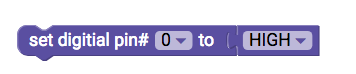
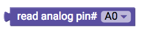
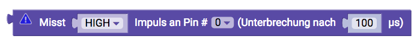

# Input/Output {#head}

These blocks control the digital and analog pins of the senseBox MCU.

     
     

    

        

            
        

        

            <h4>digitalen Pin mit Strom versorgen</h4>
            This block lets you turn digital pins on or off. The status is set by a Boolean variable, which is either High (ON) or Low (OFF). 
        

    

    

        

            
        

        

            <h4>Reading out a digital pin status</h4>
            This block allows you to read the status of a digital pin and check it or current flows or not.
        

    

    

        

            
        

        

            <h4>Turn on built-in LED</h4>
            The senseBox MCU has a small built-in LED next to the reset button, which can be switched on or off with this block.
        

    

    

        

            
        

        

            <h4>set Analog Pin</h4>
            The pins of the senseBox MCU can also be used as analog outputs or inputs. In contrast to the digital pins, analog pins can display more than two different states. The analog pins are equipped with a 10 bit analog-to-digital converter and can therefore take values between 0 and 1023.  
            With this block you can assign a value to an analog pin. 0 means that no current flows. 1023 means that a current with a voltage of 5V flows.
        

    

    

        

            
        

        

            <h4>read Analog Pin</h4>
            The analog pins can also be read out. Specifically, the voltage between 0 and 5 is measured and converted to a value between 0 and 1023.
        

    

    

        

            
        

        

            <h4>Pulse duration Measurement</h4>
            This block can be used to measure times of pulses at pins. The time is returned in microseconds.
        

    

    

        

            
        

        

        

    

