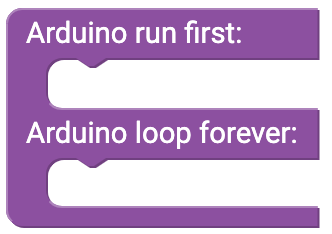
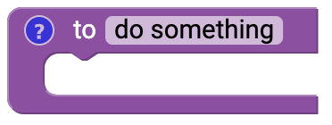
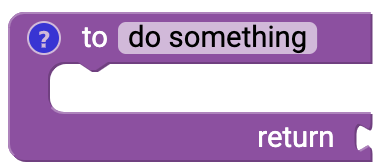

# Funktionen {#head}

     
     

    

        

            
        

        

            <h4>Setup() and Loop()</h4>
            This block is loaded directly when the user interface is started and should always be used. The two basic functions Setup() and Loop() are always needed to write a function-enabled program. 
            <h6>Setup()</h6>
            All blocks within the Setup() function are only executed at the beginning of the program <b>once</b>. In this function, for example, the display is initialized or the Wlan connection is established.
            <h6>Loop()</h6>
            All blocks within the loop() are executed continuously. The microcontroller executes all blocks from top to bottom. In the endless loop(), for example, the sensors are read out or the measured values are stored or transmitted on an SD card. 
        

    

    

        

            
        

        

            <h4>Create own function (without return value)</h4>
            Besides the two functions Setup() and Loop () you can also create your own functions. With own functions your program code becomes more structured. When you create a new function, it appears in category Functions and you can use it in Setup() or Loop(). The program code then calls your own function at this point and performs the actions in it. By default, this function has no return value.
        

    

    

        

            
        

        

            <h4>Create own function (with return value)</h4>
            Functions with a return value can also be created. This function then returns a value that can be used in your program code. 
        

    

