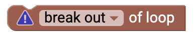

# Schleifen {#head}

Schleifen sind ein einfaches Steuerelement für deinen Programmcode. Mit einer Schleife kannst Steuern wie oft bestimmte Aktionen ausgeführt werden sollen.

     
     

    

        

            
        

        

            <h4>Wiederhole X-Mal</h4>
            Diesen Block kannst du verwenden, wenn du eine bestimmte Aktion wiederholt ausführen willst. Mithilfe der Zahl kannst du einstellen, wie oft die Aktion innerhalb der Schleife wiederholt werden soll. 
        

    

    

        

            
        

        

            <h4>Wiederhole solange</h4>
            Mithilfe dieses Blockes kannst du eine bestimmte Aktion wiederholen lassen, <i>solange</i> einer Bedinung WAHR ist. Füge an diesen Block eine <a href="../blocks/logik.html">Vergleichsbedingung</a> an. Im Dropdown Menü hast du auch die Auswahlmöglichkeit die Aktion wiederholen zu <i>bis</i> die Vergleichsbedinungen war ist. 
        

    

    

        

            
        

        

            <h4>For-Schleife</h4>
            Dieser Block beschreibt die typische for-Schleife in der Programmierung. Mithilfe einer Laufvariable <i>i</i> und einem Laufzeitbereich (z.B 1-10) und einer Schrittweite lässt sich genauer Steuern wie oft und welche Aktion ausgeführt werden soll. 
        

    

    

        

            
        

        

            <h4>Schleife abbrechen</h4>
            Dieser Block sorgt dafür, dass die aktuelle Schleife sofort abgebrochen wird und der Programmcode weiterläuft. Im Dropdown Menü lässt sich auch auswählen, dass <i>mit der nächsten Iteration der Schleife</i> fortgefahren wird.
        

    

