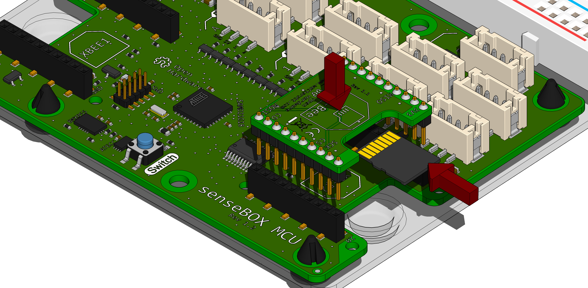
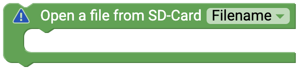
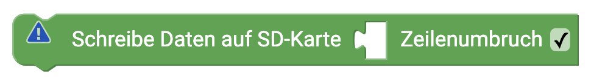

# senseBox SD Card {#head}

To save data to SD card you need a micro SD card and the mSD-Bee. 

To use these blocks, plug the mSD-Bee into XBEE2
 slot

    

        

            
        

    

    

        

            
        

        

            <h4>Create file on SD card </h4>
            Various blocks are required to store data on the SD card. The first step is to create a new file in Setup(). You can also create several different files with this block. 
        

    

    

        

            
        

        

            <h4>Open a file on the SD card </h4>
           The respective file is opened in an endless loop. When the file is open you can write to it. 
        

    

    

        

            
        

        

        <h4>Write data to SD card </h4>
            With this block you write measured values or texts into the opened file. 
        

    

