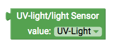
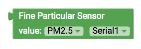
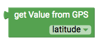
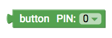
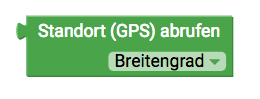

# senseBox Sensoren {#head}

Diese Seite gibt dir eine Übersicht über die Verfügbaren Blöcke mit denen du die Sensoren der senseBox auslesen und ansteuern
    kannst

     
     

    

        

            
        

        

            <h4>Temperatur und Luftfeuchtigkeitssensor</h4>
            <h6>Anschluss: I2C/Wire</h6>
            Dieser Block gibt dir den Messwert des
            <a href="../komponenten/sensoren/hdc1080.html">Temperatur und Luftfeuchtigkeitssensor</a>. Im Dropdown Menü kannst du den jeweiligen Messwert auswählen. Dropdown:
            <ul>
                <li> Temperatur </li>
                <li> Luftfeuchtigkeit </li>
            </ul>
        

    

    

        

            
        

        

            <h4>UV-Licht und Lichtsensor</h4>
            <h6>Anschluss: I2C/Wire</h6>
            Dieser Block gibt dir den Messwert des
            <a href="../komponenten/sensoren/belichtung-und-uv.html">UV-Licht und Lichtsensor</a>. Im Dropdown Menü kannst du den jeweiligen Messwert auswählen. Dropdown:
            <ul>
                <li> UV-Licht </li>
                <li> Helligkeit </li>
            </ul>
        

    

    

        

            
        

        

            <h4>Feinstaubsensor</h4>
            <h6>Anschluss: UART/Serial</h6>
            Dieser Block gibt dir den Messwert des
            <a href="../komponenten/sensoren/feinstaub.html">Feinstaubsensor</a> . Im Dropdown Menü kannst du den jeweiligen Messwert auswählen. Dropdown (Messwert):
            <ul>
                <li> PM10 </li>
                <li> PM2.5 </li>
            </ul>
            Dropdown:
            <ul>
                <li> Serial1 </li>
                <li> Serial2 </li>
            </ul>
        

    

    

        

            
        

        

            <h4>Luftdrucksensor</h4>
            <h6>Anschluss: I2C/Wire</h6>
            Dieser Block gibt dir den Messwert des <a href="../komponenten/sensoren/luftdruck-temperatur.html">Luftdruck</a>. Der Luftdruck wird vom Sensor in Pascal (Pa) ausgegeben. Benötigst du den Wert in Hektopascal (hPa) teile durch 100.
        

    

    

        

            
        

        

            <h4>Ultraschall Distanzsensor</h4>
            <h6>Anschluss: Digital</h6>
            Dieser Block gibt dir den Messwert des Ultraschall Distanzsensor. Der ausgegebene Messwert entspricht der Distanz in Zentimeter.
            Beachte beim Anschluss des Sensor auf die korrekte Auswahl der Pins im Dropdown Menü.   
            <!-- Button trigger modal -->
            <button type="button" class="btn-modal" data-toggle="modal" data-target="#Modal-Ultrasonic">
                Schaltung: Ultraschall Distanzsensor
            </button>

            <!-- Modal begin -->
            

                

                    

                        

                            <h5 class="modal-title" id="ModalLabelUltrasonic">Schaltung: Ultraschall Distanzsensor</h5>
                            <button type="button" class="close" data-dismiss="modal" aria-label="Close">
                                &times;
                            </button>
                        

                        

                            
                        

                        

                            <button type="button" class="btn btn-modal" data-dismiss="modal">Schließen</button>
                        

                    

                

            
 <!--Modal end-->
        

    

    

        

            
        

        

            <h4>Lautstärkesensor</h4>
            <h6>Anschluss: Digital</h6>
            Dieser Block gibt dir den Messwert des Lautstärkesensor. Der ausgegebene Messwert ist ein Pegelwert zwischen 0 und 1023.
            Beachte beim Anschluss des Sensor auf die korrekte Auswahl der Pins im Dropdown Menü.<!-- Button trigger modal -->
            <button type="button" class="btn-modal" data-toggle="modal" data-target="#Modal-Sound">
                Schaltung: Lautstärkesensor
            </button>

            <!-- Modal begin -->
            

                

                    

                        

                            <h5 class="modal-title" id="ModalLabelSound">Schaltung: Lautstärkesensor</h5>
                            <button type="button" class="close" data-dismiss="modal" aria-label="Close">
                                &times;
                            </button>
                        

                        

                            
                        

                        

                            <button type="button" class="btn btn-modal" data-dismiss="modal">Schließen</button>
                        

                    

                

            
 <!--Modal end-->
        

    

    

        

            
        

        

            <h4>Lichtwiderstand</h4>
            <h6>Anschluss: Digital</h6>
            Dieser Block gibt dir den Messwert des Lichtwiderstand. Der ausgegeben Messwert ist ein Pegel zwischen 0 und 1023. Je heller es ist, desto höher ist der Messwert. 
            Beachte beim Anschluss des Sensor auf die korrekte Auswahl der Pins im Dropdown Menü.<!-- Button trigger modal -->
            <button type="button" class="btn-modal" data-toggle="modal" data-target="#Modal-LDR">
                Schaltung: Lichtwiderstand
            </button>

            <!-- Modal begin -->
            

                

                    

                        

                            <h5 class="modal-title" id="ModalLabelLDR">Schaltung: Lichtwiderstand</h5>
                            <button type="button" class="close" data-dismiss="modal" aria-label="Close">
                                &times;
                            </button>
                        

                        

                            
                        

                        

                            <button type="button" class="btn btn-modal" data-dismiss="modal">Schließen</button>
                        

                    

                

            
 <!--Modal end-->
        

    

    

        

            
        

        

            <h4>Button</h4>
            <h6>Anschluss: Digital</h6>
            Dieser Block gibt dir den Status des angeschlossenen Buttons. Der Status des Buttons wird als Boolean Variable übergeben und ist entspricht 1/HIGH (Gedrückt)
            Beachte beim Anschluss des Sensor auf die korrekte Auswahl der Pins im Dropdown Menü (der Button der MCU kann über den Pin 0 angesteuert werden).
        

    

    

        

            
        

        

            <h4>Potentiometer</h4>
            <h6>Anschluss: Digital</h6>
            Dieser Block gibt dir den Messwert des Ultraschall Distanzsensor. Der ausgegebene Messwert entspricht der Distanz in Zentimeter.
            Beachte beim Anschluss des Sensor auf die korrekte Auswahl der Pins im Dropdown Menü.
        

    

    

        

            
        

        

            <h4>GPS Sensor</h4>
            <h6>Anschluss: I2C/Wire</h6>
            Dieser Block gibt dir verschiedene Messwerte des
            <a href="../komponenten/zubehoer/gps.html">GPS Sensors</a>. Neben dem Längen- und Breitengrad für die Standortbestimmtung kann der Sensor auch die Höhe
            (in Meter) und die aktuelle Geschwindigkeit (in km/h) ausgeben. Dropdown:
            <ul>
                <li> Breitengrad </li>
                <li> Längengrad </li>
                <li> Höhe </li>
                <li> Geschwindigkeit </li>
            </ul>
        

    

