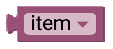
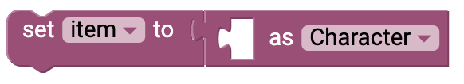

# Variables {#head}

variables are used as placeholders as in mathematics. Variables always have a data type and the value of a variable can be changed in the course of the program. Variables can be created as global variables using the blocks. More information about the functions and possible uses of the individual blocks can be found on this page 

     
     

    

        

            
        

        

            <h4>Retrieve variables </h4>
            This block gives you access to the variable if you want to query or output it (e.g. on the display). By default, the name of a new variable is "Element", but the drop-down menu gives you access to the following functions:
            <ul>
            <li>An overview of all the variables defined in the program</li>
            <li>An option to change the name of the current variable </li>
            <li>Create a new variable </li>
            </ul>
            You will find this dropdown menu in all blocks where you have access to the variables. 
        

    

    

        

            
        

        

            <h4>Write variables </h4>
           With this block you can assign a value or a text to a variable. For example, it is also possible to directly connect the readout of a sensor to the block. The block automatically recognizes the data type of the return value and creates a corresponding variable.
        

    

    

        

            
            
        

        

            <h4>Write variables with specific data type </h4>
            As a rule, the data type of a variable is recognized automatically. But you also have the possibility to assign a specific datatype to the variable. In the dropdown menu you will find the following data types:
            <ul>
                <li>characters <i>(Char)</i>: Allows single characters to be saved</li>
                <li>Text <i>(String)</i>: Saves individual texts</li>
                <li>Boolean <i>(boolean)</i>: Can take the value TRUE or FALSE/FALSE</li>
                <li>number <i>(int)</i>: integer numbers (-32,768 to 32,767) </li>
                <li>large number <i>(long)</i>: -2,147,483,648 to 2,147,483,647 </li>
                <li>decimal number <i>(float)</i>: Decimal numbers between -3.4028235E+38 and +3.4028235E+38 </li>
        

   
