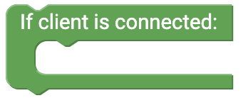

# senseBox Web {#head}

Hier findest du alle Blöcke, um einen Webserver mithilfe der senseBox zu bauen. Für den Webserver benötigst du das WiFi-Bee.

    

        

            
        

        

            <h4>HTTP-Server initialisieren</h4>
            Verwende diesen Block im Setup() um den HTTP-Server zu initialisieren. Über das Feld Port kannst du einstellen über welchen Port der Server im Broswer erreichbar sein soll. Standardmäßig ist hier Port 80 eingetragen.
        

    

    

        

            
        

        

            <h4>Wenn Client verbunden ist</h4>
            Dieser Block wird in der Endlosschleife verbunden. In den freien Blockabschnitt fügst du die Blöcke ein, die ausgeführt werden sollen, wenn eine Client (z.B. ein Nutzer über den Browser) auf den den Server zugreift.
        

    

    

        

            
        

        

            <h4>IP-Adresse</h4>
            Dieser Block gibt dir die IP-Adresse deiner senseBox im Netzwerk zurück.
        

    

    

        

            
        

        

            <h4>Methode</h4>
            Dieser Block gibt dir die Methode zurück.
        

    

    

        

            
        

        

            <h4>URI</h4>
            Dieser Block gibt dir die URI zurück.
        

    

    

        

            
        

        

            <h4>User-Agent</h4>
            Dieser Block gibt dir die User-Agent des Clienten, der auf den HTTP-Server zugreift zurück.
        

    

    

        

            
        

        

            <h4>Erfolgreiche HTTP-Antwort</h4>
            Mit diesem Block kannst du einen HTTP Antwort an den Clienten senden, wenn dieser auf den Server zugreift. Die Antwort ist der HTML Code, der aus verschiedenen Blöcken zusammengebaut werden kann. 
        

    

    

        

            
        

        

            <h4>404-Fehler</h4>
            Dieser Block kannst als Mögliche HTTP Antwort gesendet werden, wenn eine fehlerhafte Seite aufgerufen wird. 
        

    

    

        

            
        

        

            <h4>HTML</h4>
            Dies ist der Grundbaustein für den HTML Code. An den Body hängst du deinen HTML Code, der den Aufbau der Website beschreibt.
        

    

    

        

            
        

        

            <h4>Tag</h4>
            Mit den Tags kannst du deine HTML-Seite direkt über Blockly aufbauen. 
        

    

    

        

            
        

        

            <h4>Lese HTML von SD Karte</h4>
            Diesen Block kannst du an den Grundbaustein für den HTML Code anhängen und eine .html Datei von SD-Karte laden. 
        

    

