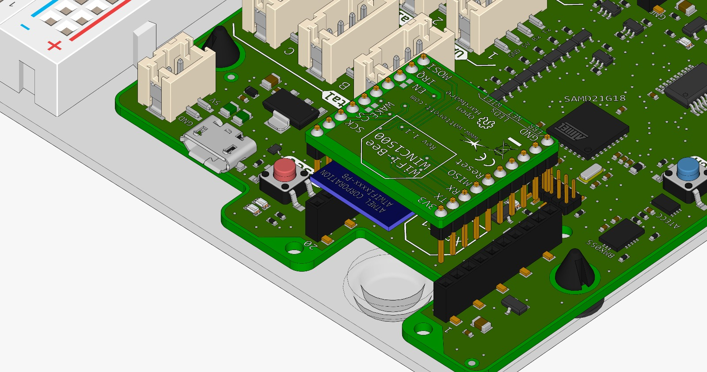

# WiFi {#head}

Hier findest du alle Blöcke, die eine Verbindung zum Internet benötigen. 

Um diese Blöcke verwenden zu können stecke des WiFi-Bee auf Steckplatz XBEE1

    

        

            
        

        

            <h4>Verbinde mit WLAN</h4>
            Verwende diesen Block im Setup() um eine Wlan Verbindung herzustellen. Trage den entsprechenden Netzwerknamen (SSID) und
            das Passwort ein.
        

    

    

        

            
        

        

            <h4>Initialisiere WLAN Access Point</h4>
            Verwende diesen Block im Setup() um mit der senseBox einen Wlan Acces Point zu erstellen. Anschließend kann sich ein Gerät (z.B. Handy oder Computer direkt) direkt mit der senseBox verbinden.
        
