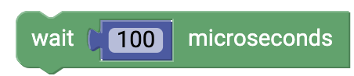

# Time {#head}

     
     

    

        

            
        

        

            <h4> Interrupt program code</h4>
            With this block you can interrupt your program code for a certain time. During this time the microcontroller pauses and no actions are executed. The time is given in milliseconds (1 second = 1000 milliseconds).
        

    

    

        

            
        

        

            This block has the same function as the previous block, but a time in microseconds is given here.
        

    

    

        

            
        

        

            <h4>Already elapsed time</h4>
            This block gives you the time your program code is already running. The runtime is given in milliseconds.
        

    

    

        

            
        

        

             This block also tells you the runtime since the start of your program, but this time in microseconds.
        

    

    

        

            
        

        

           <h4>wait forever </h4>
           With this block you can simply let your program finish.
        

    

    

        

            
        

        

            <h4>Measurement interval</h4>
            So that the transmission of the measured values does not take place every second, but only after a certain time interval, you can
            block. To do this, drag all actions that are to take place first after a certain time into the loop and enter the time in milliseconds. 
        

    

