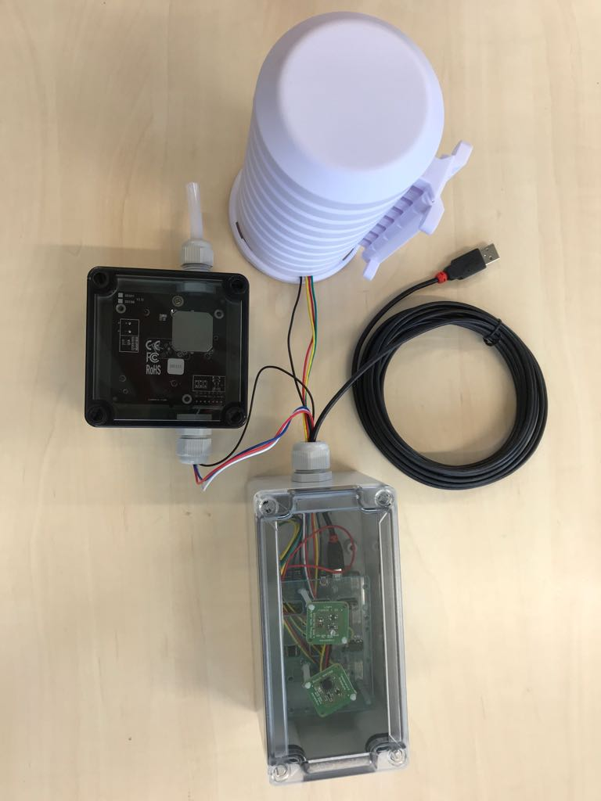

#Step 7: Assembly in Case {#head}

Below the assembling of the senseBox:home in the case is going to be explained. 

     
     

##Inventory

### Basic Configuration

- case with lid
- mini-USB wire + adapter
- senseBox MCU
- sensor for air humidity and temperature
- protective case for air humidity and temperature sensor + attachments
- plexiglas with plastic bolts
- M20 screw thread
- bag with 8 screws 
- Bee

# Installation

## 1. Step

*mounting of senseBox MCU in the case:* 

Therefor you have to align the MCU so that the micro USB-access and the red button are pointing to the hole in the case. Please screw the MCU to the case with the two provided screws. Use therefor the two holes in the middle of the long side of the MCU.

## 2. Step

*Connecting Bee and humidity-/ temperaturesensor:*

Independently which bee you are using, in the next step you have to mount the bee on the intended *XBEE1* slot.

## 3. Step

*Pin of the sensor and the mini-USB wire:*

For this you have to first screw the M20 thread in the hole on the side of the case.
Please then unscrew the cover and put the wire (without sensor) and the mini-USB wire whereby the opening of the screw thread. Now you can screw the cover on to the screw thread again and connect the sensor with the wire. 
The sensor plug can be attached to one of the 5 *12C/Wire* slots.
**Please connect the mini-USB wire not before everything is built together.**

## 4. Step

*mounting the sensor in the protective case*

The protective case ensures that temperature- and air humiditysensors are not exposed directly to the Sun. To install the sensor in the case you have to enlarge the hole in the underside of the case so that the sensor fits through.

Now you can mount the sensor with the two plastic bolts (see photo) or zip ties on to the little framework.
You can now mount the case wherever you want with the attachments.

    <i class="fa fa-exclamation-circle fa-fw" aria-hidden="true" style="color: #f0ad4e"></i>
    Achte darauf, dass der Sensor dabei nach oben zeigt! 

# Additional Components  (optional)
 

## 5. Step

In case you want to add further sensors, please initially connect the intended wire with the 12C/Wire ports. If you have a fine dust sensor begin with putting the wire through the screw thread. Following connect the other end of the wire to the UART/Serial port 1. 
Now push the 4 plastic bolts in the outer holes of the MCU

## 6. Step

In the next step please remove the plastic foil of the Plexiglas. Now you can put each wires through the middle of the 3 holes. 
Position respectively 2 plastic bolts for one sensor and the little holes so that the sensors can be mounted central on the Plexiglas 
 **This is especially important for the UV sensor!**

## 7. Step 

*Installation of the finedustsensor*

- finedustsensor
- case
- 2 M16 screw threads
- wire
- plastic tube 

Please follow the instruction for the pin of the finedustsensor:
First unscrew the cap and afterward the rubberseal in the screw thread. 
Now you can successively put the sensor wire through the just detached components.
Then stick the wire through the hole in the case and connect it with the sensor.

    <i class="fa fa-exclamation-circle fa-fw" aria-hidden="true" style="color: #f0ad4e"></i>
Please do not fasten the screw thread at this point!

Stick now the plastic tube on to the entry of the finedustsensor and afterwards through the other hole in the case.
Now you can fasten the screw thread on both sides of the case and mount the lid on to the case.
 

## Completed Installation of the senseBox:home

 The senseBox:home below includes temperature, humidity, finedust, UV and airpressure sensors. 

