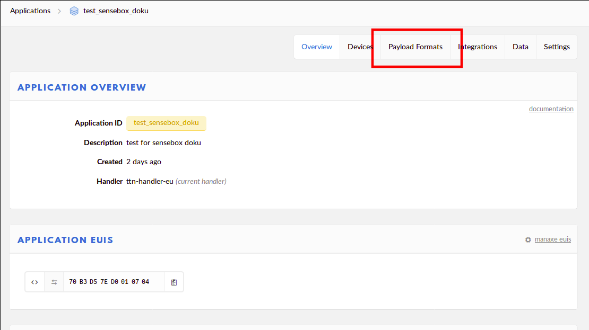

# LoRa-Bee {#head}
<div class="description">Use the LoRa-Inferface to upload your data onto the openSenseMap. The `LoRa WAN-Bee-Modul` is a low energy and cost free option to upload your data unsing the LoRa-Radio-Standard. Therefore existing LoRa-Networks such as `TheThingsNetwork` are used for data transmission. The necessary infratructure is provided by the community of `TheThingsNetwork` and available in increasingly more regions. 

</div>

<div class="line">
    <br>
    <br>
</div>


# Technical Information
* HopeRF RFM95W/RFM96W LoRa Transceiver
* LoRa-Bee 868 / 915 MHz uses RFM95W (SX1276 compatible)
* LoRa-Bee 433 / 470 MHz uses RFM96W (SX1276 compatible)
* SPI interface
* Indication: RFN9xW
* Measurements: 46mm x 25mm x 12mm
* Weight: 1,1 g

# Information
Please check if your area is already covered by LoRa before you get your senseBox with LoRa Bee: https://www.thethingsnetwork.org/community#list-communities-map

**Attention: Due to the increased complexity of the installation, we only recommend the LoRa module to advanced users of open hardware**


# Upload via LoRaWAN

It is possible to load sensor data via LoRaWAN ™ by the [TheThingsNetwork] (https://thethingsnetwork.org)
(TTN) to the openSenseMap.
LoRa is an increasingly popular radio standard, which is similar to WiFi. It allows digital data transmission in an IP network, but provides notable different features including:

- Data throughput: 300 - 3000 Bit/s
- Range:     up to 15km 

TTN is one of several projects that are related to the radio hardware
Infrastructure implemented for the IP network. Whereby registered devices can be connected to the internet


Users can add *Gateways* as well as *Nodes* to the network.


## TTN openSenseMap Integration
The openSenseMap provides a direct integration into the TTN network, which simplifies the
configuration. You therefor need to create an account on [TheThingsNetwork] (https://thethingsnetwork.org).

### Registration in TTN Console

To integrate a device in to the TTN you have to first register an *Application* and a *Device* on the [thethingsnetwork.org](https://console.thethingsnetwork.org/) Here you receive a `app_id` and a `dev_id`.

For the registered application, the HTTP integration must be activated under <https://console.thethingsnetwork.org/applications/DEINE_APPID/integrations/create/http-ttn>. 
To transmit messages from devices via `POST` to `https://ttn.opensensemap.org/v1.1`, you have to configurate this
The authorization-field can stay empty.


For the data transfer to openSenseMap, the `app_id` and `dev_id` must be included for the registration on openSenseMap in the TTN configuration. In addition, a suitable decoding profile must be configured. Which determines how the - because of the low bandwidth as raw bytes transmitted - data should be interpreted as measurements.


Optionally you can indicate a port in the field `port`, on which the transmitter can send his data to the TTN. So you can use the same `app_id` and `dev_id` for multiple sensor stations.

### Arduino Sketch 
This could be an Arduino sketch that lets you send data to the openSenseMap over the TTN network.

<div class="box_warning">
     <i class="fa fa-exclamation-circle fa-fw" aria-hidden="true" style="color: #f0ad4e"></i>
    <b>Important:</b> You have to paste your recently created <b>Application-EUI, Device-EUI</b> and the <b>App-Key</b> in the sketch. Please do this in the first line of the code where <b>'INSERT YOUR ID HERE'</b> is indicated. <br><br> Mind that you have to choose the <b>lsb</b>-format for the <b>Device-EUI</b> and <b>Application-EUI</b> and the and the <b>msb</b>-format for the<b>App-Key</b>.
</div>




```arduino
/*******************************************************************************
 * Copyright (c) 2015 Thomas Telkamp and Matthijs Kooijman.
 * Edited by: senseBox
 *
 *******************************************************************************/
#include <LoraMessage.h>
#include <lmic.h>
#include <hal/hal.h>
#include <SPI.h>
#include <senseBoxIO.h>

#include <Adafruit_Sensor.h>
#include <Adafruit_BMP280.h>
#include <HDC100X.h>
#include <Makerblog_TSL45315.h>
#include <SDS011-select-serial.h>
#include <VEML6070.h>

// Number of serial port the SDS011 is connected to. Either Serial1 or Serial2
#define SDS_UART_PORT (Serial1)

//Load sensors / instances
Makerblog_TSL45315 TSL = Makerblog_TSL45315(TSL45315_TIME_M4);
HDC100X HDC(0x40);
Adafruit_BMP280 BMP;
VEML6070 VEML;
SDS011 SDS(SDS_UART_PORT);

bool hdc, bmp, veml, tsl = false;

//measurement variables
float temperature = 0;
float humidity = 0;
float pm10 = 0;
float pm25 = 0;
double tempBaro, pressure;
uint32_t lux;
uint16_t uv;

// This EUI must be in little-endian format, so least-significant-byte
// first. When copying an EUI from ttnctl output, this means to reverse
// the bytes. For TTN issued EUIs the last bytes should be 0xD5, 0xB3,
// 0x70.
static const u1_t PROGMEM APPEUI[8]={ 'Your APP ID Here' };
void os_getArtEui (u1_t* buf) { memcpy_P(buf, APPEUI, 8);}

// This should also be in little endian format, see above.
static const u1_t PROGMEM DEVEUI[8]={ 'YOUR DEVICE ID HERE '};
void os_getDevEui (u1_t* buf) { memcpy_P(buf, DEVEUI, 8);}

// This key should be in big endian format (or, since it is not really a
// number but a block of memory, endianness does not really apply). In
// practice, a key taken from ttnctl can be copied as-is.
// The key shown here is the semtech default key.
static const u1_t PROGMEM APPKEY[16] = { 'YOUR APP KEY HERE '};
void os_getDevKey (u1_t* buf) {  memcpy_P(buf, APPKEY, 16);}

static osjob_t sendjob;

// Schedule TX every this many seconds (might become longer due to duty
// cycle limitations).
const unsigned TX_INTERVAL = 300;

// Pin mapping
const lmic_pinmap lmic_pins = {
    .nss = PIN_XB1_CS,
    .rxtx = LMIC_UNUSED_PIN,
    .rst = LMIC_UNUSED_PIN,
    .dio = {PIN_XB1_INT, PIN_XB1_INT, LMIC_UNUSED_PIN},
};

void checkI2CSensors() {
  byte error;
  int nDevices = 0;
  byte sensorAddr[] = {41, 56, 57, 64, 118};
  tsl = false; veml = false; hdc = false; bmp = false;
  Serial.println("\nScanning...");
  for (int i = 0; i < sizeof(sensorAddr); i++) {
    Wire.beginTransmission(sensorAddr[i]);
    error = Wire.endTransmission();
    if (error == 0) {
      nDevices++;
      switch (sensorAddr[i])
      {
        case 0x29:
          Serial.println("TSL45315 found.");
          tsl = true;
          break;
        case 0x38: // &0x39
          Serial.println("VEML6070 found.");
          veml = true;
          break;
        case 0x40:
          Serial.println("HDC1080 found.");
          hdc = true;
          break;
        case 0x76:
          Serial.println("BMP280 found.");
          bmp = true;
          break;
      }
    }
    else if (error == 4)
    {
      Serial.print("Unknown error at address 0x");
      if (sensorAddr[i] < 16)
        Serial.print("0");
      Serial.println(sensorAddr[i], HEX);
    }
  }
  if (nDevices == 0) {
    Serial.println("No I2C devices found.\nCheck cable connections and press Reset.");
    while(true);
  } else {
    Serial.print(nDevices);
    Serial.println(" sensors found.\n");
  }
  //return nDevices;
}

void onEvent (ev_t ev) {
    senseBoxIO.statusGreen();
    Serial.print(os_getTime());
    Serial.print(": ");
    switch(ev) {
        case EV_SCAN_TIMEOUT:
            Serial.println(F("EV_SCAN_TIMEOUT"));
            break;
        case EV_BEACON_FOUND:
            Serial.println(F("EV_BEACON_FOUND"));
            break;
        case EV_BEACON_MISSED:
            Serial.println(F("EV_BEACON_MISSED"));
            break;
        case EV_BEACON_TRACKED:
            Serial.println(F("EV_BEACON_TRACKED"));
            break;
        case EV_JOINING:
            Serial.println(F("EV_JOINING"));
            break;
        case EV_JOINED:
            Serial.println(F("EV_JOINED"));

            // Disable link check validation (automatically enabled
            // during join, but not supported by TTN at this time).
            LMIC_setLinkCheckMode(0);
            break;
        case EV_RFU1:
            Serial.println(F("EV_RFU1"));
            break;
        case EV_JOIN_FAILED:
            Serial.println(F("EV_JOIN_FAILED"));
            break;
        case EV_REJOIN_FAILED:
            Serial.println(F("EV_REJOIN_FAILED"));
            break;
            break;
        case EV_TXCOMPLETE:
            Serial.println(F("EV_TXCOMPLETE (includes waiting for RX windows)"));
            if (LMIC.txrxFlags & TXRX_ACK)
              Serial.println(F("Received ack"));
            if (LMIC.dataLen) {
              Serial.println(F("Received "));
              Serial.println(LMIC.dataLen);
              Serial.println(F(" bytes of payload"));
            }
            // Schedule next transmission
            os_setTimedCallback(&sendjob, os_getTime()+sec2osticks(TX_INTERVAL), do_send);
            break;
        case EV_LOST_TSYNC:
            Serial.println(F("EV_LOST_TSYNC"));
            break;
        case EV_RESET:
            Serial.println(F("EV_RESET"));
            break;
        case EV_RXCOMPLETE:
            // data received in ping slot
            Serial.println(F("EV_RXCOMPLETE"));
            break;
        case EV_LINK_DEAD:
            Serial.println(F("EV_LINK_DEAD"));
            break;
        case EV_LINK_ALIVE:
            Serial.println(F("EV_LINK_ALIVE"));
            break;
         default:
            Serial.println(F("Unknown event"));
            break;
    }
}

void do_send(osjob_t* j){
    // Check if there is not a current TX/RX job running
    if (LMIC.opmode & OP_TXRXPEND) {
        Serial.println(F("OP_TXRXPEND, not sending"));
    } else {
        LoraMessage message;

        //-----Temperature-----//
        //-----Humidity-----//
        if (hdc) {
          Serial.print("Temperature: ");
          temperature = HDC.getTemp();
          Serial.println(temperature);
          message.addUint16((temperature + 18) * 771);
          delay(2000);
     
          Serial.print("Humidity: ");
          humidity = HDC.getHumi();
          Serial.println(humidity);
          message.addHumidity(humidity);
        }
        delay(2000);
        
        if (bmp) {
          float altitude;
          tempBaro = BMP.readTemperature();
          pressure = BMP.readPressure()/100;
          altitude = BMP.readAltitude(1013.25); //1013.25 = sea level pressure
          Serial.print("Pressure: ");
          Serial.println(pressure);
          message.addUint16((pressure - 300) * 81.9187);
          delay(2000);
        }
        
        if (tsl) {
          //-----Lux-----//
          Serial.print("Illuminance: ");
          lux = TSL.readLux();
          Serial.println(lux);
          message.addUint8(lux % 255);
          message.addUint16(lux / 255);
          delay(2000);
        }
        
        if (veml) {
          //-----UV intensity-----//
          Serial.print("UV: ");
          uv = VEML.getUV();
          Serial.println(uv);
          message.addUint8(uv % 255);
          message.addUint16(uv / 255);
          delay(2000);
        }

        uint8_t attempt = 0;
        
        while (attempt < 5) {
          bool error = SDS.read(&pm25, &pm10);
          if (!error) {
            Serial.print("PM10: ");
            Serial.println(pm10);
            message.addUint16(pm10 * 10);
            Serial.print("PM2.5: ");
            Serial.println(pm25);
            message.addUint16(pm25 * 10);
            break;
          }
          attempt++;
        }

        // Prepare upstream data transmission at the next possible time.
        LMIC_setTxData2(1, message.getBytes(), message.getLength(), 0);
        Serial.println(F("Packet queued"));
    }
    // Next TX is scheduled after TX_COMPLETE event.
}

void setup() {
    Serial.begin(9600);
    delay(10000);

    // RFM9X (LoRa-Bee) in XBEE1 Socket
    senseBoxIO.powerXB1(false); // power off to reset RFM9X
    delay(250);
    senseBoxIO.powerXB1(true);  // power on

    // init I2C/wire library
    Wire.begin();

    // Sensor initialization
    Serial.println(F("Initializing sensors..."));
    SDS_UART_PORT.begin(9600);
    checkI2CSensors();

    if (veml) 
    {
      VEML.begin();
      delay(500);
    }
    if (hdc)
    {
      HDC.begin(HDC100X_TEMP_HUMI, HDC100X_14BIT, HDC100X_14BIT, DISABLE);
      HDC.getTemp();
    }
    if (tsl) 
    {
      TSL.begin();
    }
    if (bmp) 
    {
      BMP.begin(0x76);
    }
    Serial.println(F("Sensor initializing done!"));
    Serial.println(F("Starting loop in 3 seconds."));
    delay(3000);

    // LMIC init
    os_init();
    // Reset the MAC state. Session and pending data transfers will be discarded.
    LMIC_reset();

    // Start job (sending automatically starts OTAA too)
    do_send(&sendjob);
}

void loop() {
    os_runloop_once();
}
```


### Decoding Profile
A decoding-profile fitting to the measuring data has to be selected and defined for a senseBox.
The decoding profile selection is based on the encoding of the messages on the
microcontroller. And whether in the TTN a payload function has been set dependent.

- For the senseBox: home (without extensions) the `senseBox: home` profile
be used.
- If the measurements will be encoded on the LoRa node using the `lora-serialization` library
, the `lora-serialization` profile should be used.
- The `json` profile supports any other encodings, if one
Payload function in the TTN Console decodes the messages appropriately.

The following explains how to configure the supported profiles:

#### `sensebox/home`
This profile is tailored to the sensors supplied with the senseBox: home.
Besides the specification `sensebox / home` under` profile` there is no further configuration
necessary.
<br><b>This works only without the fine dust sensors(PM2.5 und PM10)</b>


In addition to the Arduino Sketch, you'll need to set up a decoder on the TTN homepage so that your metrics are sent to the openSenseMap in the correct format.




<h1 id="decoder"></h1>

<div class="box_warning">
     <i class="fa fa-exclamation-circle fa-fw" aria-hidden="true" style="color: #f0ad4e"></i>
    <b>Important:</b> Here you have to add your <b>sensor ID's</b>.
</div>

```javascript
function Decoder(bytes, port) {
  // bytes is of type Buffer.
  'use strict';
  var TEMPSENSOR_ID = 'YOUR TEMPERATURE SENSOR ID HERE',
    HUMISENSOR_ID = 'YOUR HUMIDITY SENSOR ID HERE',
    PRESSURESENSOR_ID = 'YOUR PRESSURE SENSOR ID HERE ',
    LUXSENSOR_ID = 'YOUR LUXSENSOR ID HERE ',
    UVSENSOR_ID = 'YOUR UV SENSOR ID HERE';

  var bytesToInt = function (bytes) {
    var i = 0;
    for (var x = 0; x < bytes.length; x++) {
      i |= +(bytes[x] << (x * 8));
    }
    return i;
  };

  var uint8 = function (bytes) {
    if (bytes.length !== uint8.BYTES) {
      throw new Error('int must have exactly 1 byte');
    }
    return bytesToInt(bytes);
  };
  uint8.BYTES = 1;

  var uint16 = function (bytes) {
    if (bytes.length !== uint16.BYTES) {
      throw new Error('int must have exactly 2 bytes');
    }
    return bytesToInt(bytes);
  };
  uint16.BYTES = 2;

  var humidity = function (bytes) {
    if (bytes.length !== humidity.BYTES) {
      throw new Error('Humidity must have exactly 2 bytes');
    }

    var h = bytesToInt(bytes);
    return h / 1e2;
  };
  humidity.BYTES = 2;

  var decode = function (bytes, mask, names) {

    var maskLength = mask.reduce(function (prev, cur) {
      return prev + cur.BYTES;
    }, 0);
    if (bytes.length < maskLength) {
      throw new Error('Mask length is ' + maskLength + ' whereas input is ' + bytes.length);
    }

    names = names || [];
    var offset = 0;
    return mask
      .map(function (decodeFn) {
        var current = bytes.slice(offset, offset += decodeFn.BYTES);
        return decodeFn(current);
      })
      .reduce(function (prev, cur, idx) {
        prev[names[idx] || idx] = cur;
        return prev;
      }, {});
  };

  var bytesToSenseBoxJson = function (bytes) {
    var json;

    try {
      json = decode(bytes,
        [
          uint16,
          humidity,
          uint16,
          uint8,
          uint16,
          uint8,
          uint16
        ],
        [
          TEMPSENSOR_ID,
          HUMISENSOR_ID,
          PRESSURESENSOR_ID,
          LUXSENSOR_ID + '_mod',
          LUXSENSOR_ID + '_times',
          UVSENSOR_ID + '_mod',
          UVSENSOR_ID + '_times'
        ]);

      //temp
      json[TEMPSENSOR_ID] = parseFloat(((json[TEMPSENSOR_ID] / 771) - 18).toFixed(1));

      //hum
      json[HUMISENSOR_ID] = parseFloat(json[HUMISENSOR_ID].toFixed(1));

      // pressure
      if (json[PRESSURESENSOR_ID] !== '0') {
        json[PRESSURESENSOR_ID] = parseFloat(((json[PRESSURESENSOR_ID] / 81.9187) + 300).toFixed(1));
      } else {
        delete json[PRESSURESENSOR_ID];
      }

      // lux
      json[LUXSENSOR_ID] = (json[LUXSENSOR_ID + '_times'] * 255) + json[LUXSENSOR_ID + '_mod'];
      delete json[LUXSENSOR_ID + '_times'];
      delete json[LUXSENSOR_ID + '_mod'];

      // uv
      json[UVSENSOR_ID] = (json[UVSENSOR_ID + '_times'] * 255) + json[UVSENSOR_ID + '_mod'];
      delete json[UVSENSOR_ID + '_times'];
      delete json[UVSENSOR_ID + '_mod'];

    } catch (e) {
      json = { payload: bytes };
    }

    return json;
  };

  return bytesToSenseBoxJson(bytes);
}
```




#### `lora-serialization`
The `lora-serialization` profile can accept almost any data, even sensor stations, which have a special sensor configuration.
For this we use the [`lora-serialization`] (https://github.com/thesolarnomad/lora-serialization)
Library, which provides a unified encoding on the microcontroller, and
Decoding on the other end of the line.

The encodings `temperature`,` humidity`, `unixtime`,` uint8` and
`uint16` are supported, which need to be indicated per sensor under ** decoding options **.
The assignment of the sensor can be made via one of the properties
`sensor_id`,` sensor_title`, `sensor_unit`,` sensor_type`.

An example of two sensors looks like this:

```json
[
  { "decoder": "temperature", "sensor_title": "Temperatur" },
  { "decoder": "humidity", "sensor_unit": "%" }
]
```

> ***Information:*** *The order of the sensors must be the same here as well as on the Arduino and the >openSenseMap!*

If a `unixtime` decoder is specified, its timestamp will be used for all of
the following measurements.
Otherwise, the moment is used in which the first gateway receives the message.
Example:

```json
[
  { "decoder": "unixtime" },
  { "decoder": "temperature", "sensor_title": "Temperatur" }
]
```

#### `json` - Decoding mit TTN Payload Function
If the `lora-serialization` library is not available, measurements can still get
decoded on the TTN side by means of a * Payload Function *,
so that any data formats are supported here.


The resulting JSON must be compatible with that of the[openSenseMap-API understanding 
Measurement format](https://docs.opensensemap.org/#api-Measurements-postNewMeasurements).
A simple example:

```json
{ "sensor_id1": "value1, "sensor_id2:" "value2" }
```

An example of this is indicated for you you [above](#decoder).

On the side of the openSenseMap no configuration is necessary.
