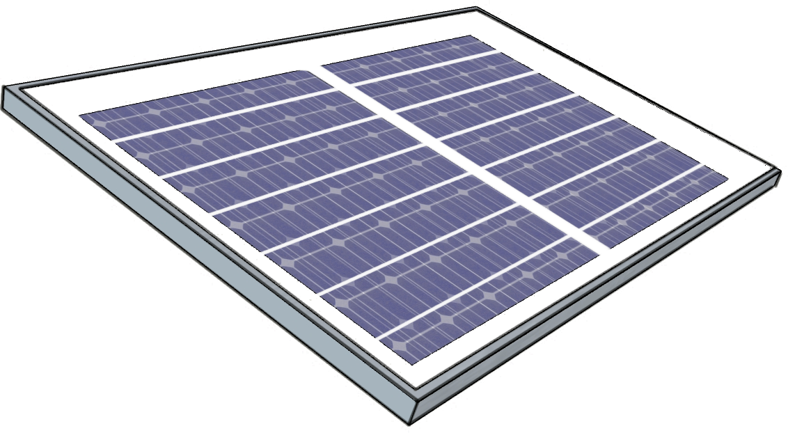

# Solar Panel {#head}

The solar panel, produced and distributed by Villageboom, is one of the new components in the sensebox-universe. With its 34x23,5cm panel kann you can operate your station whereever you want, as long the sun is shining.

     
     

## Technical details
   * Model no.: VB-010P
   * Maximum power (Pm): 10W
   * Open circuit voltage (V): 7,2V
   * Voltage at Pmax (Vm): 6,0V
   * Short-circuit current (Isc): 1,83A
   * Dimension: 340x235x17mm
   * Weight: 1kg

## Setup

To use the senseBox with a solar panel, you only need an [Adafruit Powerboost 1000C](https://learn.adafruit.com/adafruit-powerboost-1000c-load-share-usb-charge-boost/overview) and a [LiPo-battery](https://eckstein-shop.de/LiPo-Akku-Lithium-Ion-Polymer-Batterie-37V-2000mAh-JST-PH-Connector), around 1000 mAh should be enough. The powerboost guarentees, that the panel is loading the battery and the battery is powering the senseBox.
