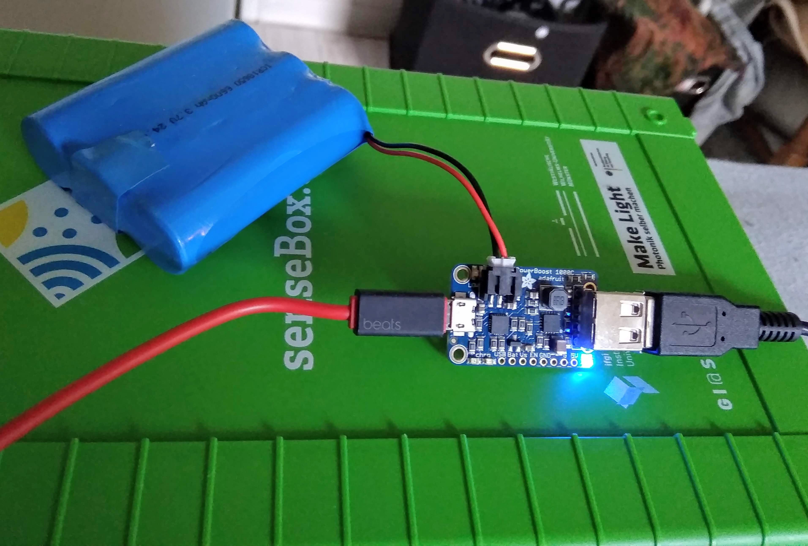

# Solar Panel Set{#head}

The whole set can be ordered [here](https://sensebox.shop/product/solar-set).

## Solar Panel

The solar panel, produced and distributed by Villageboom, is one of the new components in the senseBox-universe. With its 34x23,5cm panel you can operate your station wherever you want, as long the sun is shining.

     
     

### Technical details
   * Model no.: VB-010P
   * Maximum power (Pm): 10W
   * Open circuit voltage (V): 7.2V
   * Voltage at Pmax (Vm): 6.0V
   * Short-circuit current (Isc): 1.83A
   * Dimension: 340x235x17mm
   * Weight: 1kg

## Powerboost
 

The [Adafruit Powerboost 1000C](https://www.adafruit.com/product/2465) ensures through an integrated charging circuit that the solar cell charges the battery and the battery in turn operates the senseBox.

     
     

### Technical details
   * Max Power-Input: 3.7V
   * Max Power-Output: 5.2V
   * Chipset: [TI TPS61090](http://www.ti.com/product/TPS61090/description)
   * 2A Internal Switch
   * LEDs show battery charge
   * Weight: 6g

## Setup

To use the senseBox with a solar panel, you only need a Powerboost and a [LiPo-battery](https://eckstein-shop.de/LiPo-Akku-Lithium-Ion-Polymer-Batterie-37V-2000mAh-JST-PH-Connector), around 1000 mAh should be enough. The powerboost guarentees, that the panel is loading the battery and the battery is powering the senseBox. We recommend a [Fire Bag](https://www.amazon.de/Jamara-141360-LiPo-Guard-Lipobrandschutztasche/dp/B003OFCUIS/ref=sr_1_18?keywords=LIPO+TRESOR&qid=1556284975&s=gateway&sr=8-18) for the battery, since there is a high risk of injury when damaged. The picture below shows how the parts are connected.

     <i class="fa fa-exclamation-circle fa-fw" aria-hidden="true" style="color: #f0ad4e"></i>
     >>WARNING-HINT<<  
     The LiPo battery and the Powerboost should best be protected from moisture when you operate the station outside. The matching housing is included in the set, but is also the same as e.g. for the fine dust sensor. Also watch out at minus temperatures, then you should bring the station indoors.

