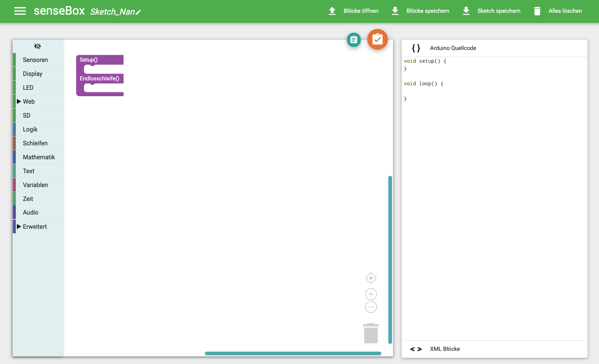

# Blockly für senseBox Online {#head}
 
Blockly für senseBox ist eine grafische Programmieroberfläche die komplett online in deinem Browser läuft. Sie ermöglicht dir deine senseBox zu programmieren ohne Software zu installieren 

     
     

Du findest Blockly für senseBox online unter <a href="https://blockly.sensebox.de">https://blockly.senseBox.de</a>. Dort kannst du zwischen den verschiedenen Versionen der senseBox auswählen. Für die senseBox MCU wird keine weitere Software benötigt. Arbeitest du mit einem anderen Arduino kompatiblen Mikrocontroller musst der Code auf deinem Computer mithilfe der Arduino IDE kompiliert und übertragen werden.

## Die Oberfläche

Blockly für senseBox läuft in den gängingen Browsern (Google Chrome, Firefox und Edge) ohne Installation. Die Oberfläche ist sowohl in Deutsch als auch in Englisch verfügbar.

    <i class="fa fa-exclamation-circle fa-fw" aria-hidden="true" style="color: #f0ad4e"></i>
    Wenn du die Sprache änderst wird die Oberfläche neu geladen und deine bisherige Programmierung wird nicht gespeichert. Du solltest dir also zu Begin überlegen ob du in der Englischen oder Deutschen Oberfläche arbeiten willst. Alternativ kannst du die deine Blöcke als XML Datei speichern und nach dem Ändern der Sprache wieder laden. 

Die Oberfläche ist grob in drei Bereiche aufgeteilt. Links findest du die Toolbox, die alle Blöcke enthält. In der Mitte ist deine Arbeitsoberfläche und rechts wird dir der generierte Arduino Code angezeigt. 

#### Die Toolbox

Hier findest du alle Blöcke, die die du für deine Programmierung verwenden kannst. Eine genaue Erläuterung zu den einzelnen Kategorien und die Funktionsweise der Blöcke findest du [hier](../blocks/README.md)

#### Buttons

In der Online Oberfläche verbergen sich die wichtigsten Funktionen hinter verschiedenen Buttons. Die beiden Buttons in der Arbeitsoberfläche sind zum kopieren des Codes in die Zwischenablage (Praktisch, wenn du z.B. deinen Code offline in der Arduino IDE kompilieren willst) und der Kompilieren Button, der den Programmcode auf dem Server Online kompiliert und anschließend dir eine fertigen Programmcode als .BIN Datei zum Download anbietet. 
In der Kopfzeile der Weboberfläche kannst du deinem Programmcode einen Namen geben, die Blöcke als XML-Datei speichern oder wieder laden, den Programmcode als .ino speichern und die komplette Arbeitsfläche mit einem klick löschen. Ganz links findes du das Menü, in dem du Zugriff auf die Einstellungen und die vorgefertigten Beispiele hast.
