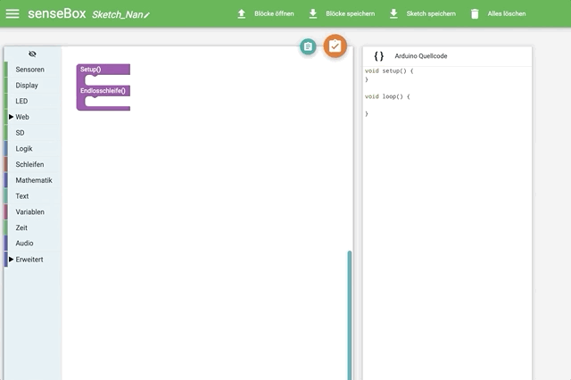

# Los geht's {#head}
 
Auf dieser Seite wird dir gezeigt, wie du dein erstes Programm erstellst und auf die senseBox MCU überträgst

     
     

Du findest Blockly für senseBox online unter <a href="https://blockly.sensebox.de">https://blockly.senseBox.de</a>. Dort kannst du zwischen den verschiedenen Versionen der senseBox auswählen. 

## Programmieren

In einem einfachen Programm wird die interne LED, die sich direkt neben dem roten Resetbutton befindet angeschaltet. Den Block zum Anschalten der LED findest du in der Toolbox unter [LED](../bloecke/led.md). 

Nach dem Programmieren muss der Programmcode auf die senseBox MCU übertragen werden. Schließe dazu die senseBox MCU mit dem USB Kabel an deinen Computer an. 

### Übertragen auf die senseBox MCU

Schließt du deine senseBox MCU an deinen Computer an und führst einen Doppelklick auf den roten Button aus wird diese als Wechseldatendräger erkannt. Mit einem Klick auf Code Kompilieren in der Weboberfläche wird dein Programmcode auf dem Server kompiliert und eine .BIN Datei wird dir zum Download angeboten. Je nachdem welches Betriebssystem du verwendest unterscheidet sich nun der Kopiervorgang. 



#### Kopieren unter Windows 

Unter Windows kannst du die erstellte .BIN Datei einfach per Drag & Drop auf den Wechseldatenträger <b>SENSEBOX</b> kopieren. Die rote LED am Button wird kurz flackern und anschließend startet das Board selbstständig neu und führt deinen Programmcode aus. 



#### Kopieren unter MacOS

Unter MacOS funktioniert das kopieren der .BIN per Drag & Drop leider zurzeit noch nicht. Eine Möglichkeit ist die Datei im Terminal per dd-Befehl zu kopieren (nur erfahrenen Nutzern zu empfehlen!) oder einen alternativen Dateimanager wie zum Beispiel [muCommander](http://www.mucommander.com/) zu verwenden.



#### Kopieren unter Linux 

Unter Linux kannst du die erstellte .BIN Datei einfach per Drag & Drop auf den Wechseldatenträger <b>SENSEBOX</b> kopieren. Die rote LED am Button wird kurz flackern und anschließend startet das Board selbstständig neu und führt deinen Programmcode aus. 


