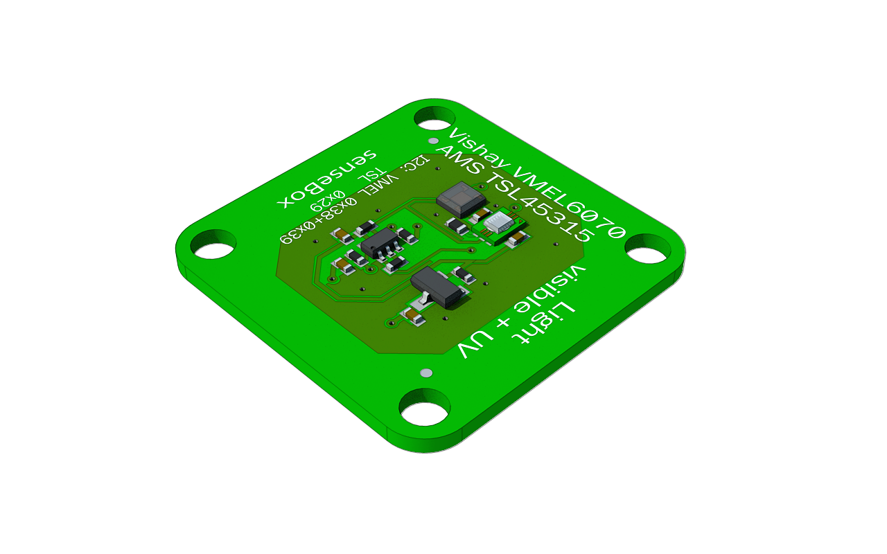
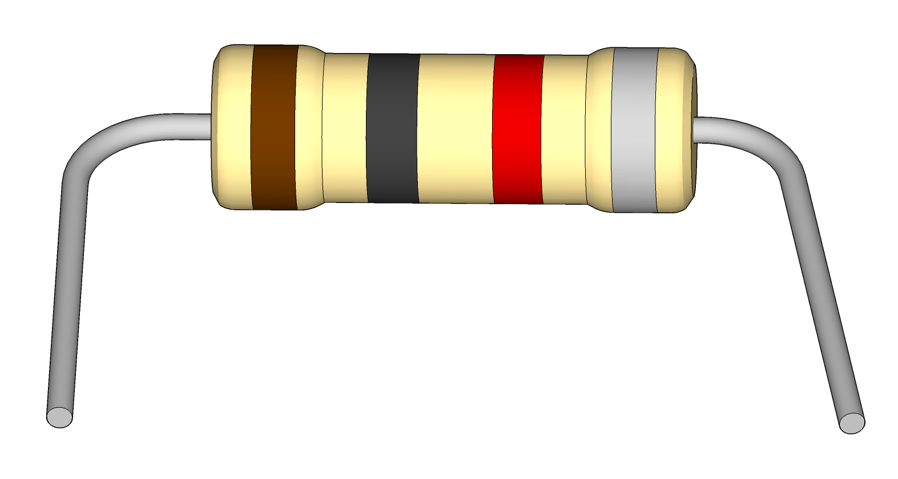
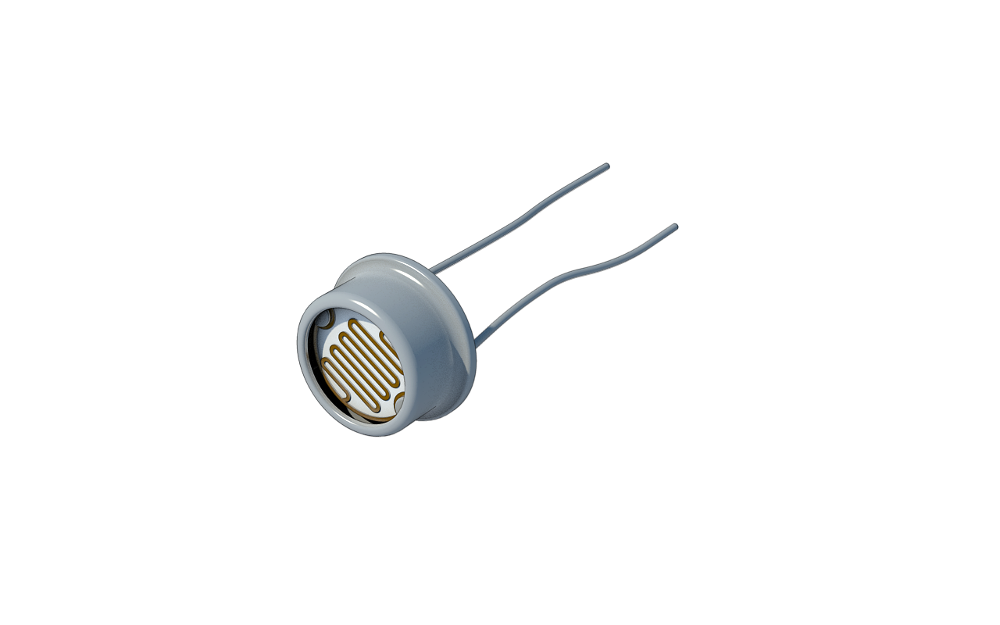

# The senseBox:edu and its content {#head}
 

     
     

## Overview of the content

### The senseBox MCU

The senseBox MCU is the core part of the senseBox and has a variety of connection options. 

### Sensors

    

        

                <h4>Temperature- and Humiditysensor</h4>
                
                
Connection: I2C/Wire Ports

        

        

                <h4>Illuminance and UV-Sensor</h4>
                
                
Connection: I2C/Wire Ports

        

        

                <h4>Airpressure and Temperaturesensor</h4>
                
                
Connection: I2C/Wire Ports

        

        

                <h4>Ultrasonic-Distancesensor</h4>
                
                
Connection: Digital/Analog Ports

        

        

                <h4>Microphone</h4>
                
                
Connection: Digital/Analog Ports

        

    

### Cables 

Various cables are used to connect the sensors and other electronic components to the senseBox MCU. 

    

            

                    <h4>JST-JST Cable</h4>
                    
                    
Used to connect the environmental sensors

            

            

                    <h4>JST-Adaptercable</h4>
                    
                    
Used to connect sensors via the breadboard

            

            

                    <h4>Jumperwires</h4>
                    
                    
Used for circuits on the breadboard

            

    
    

### Display and Bees

        

                

                        <h4>OLED-Display</h4>
                        
                        
Connection: I2C/Wire

                

                

                        <h4>WiFi-Bee</h4>
                        
                        
Connection: Port XBEE1

                

                

                        <h4>mSD-Bee</h4>
                        
                        
Connection: Port XBEE2

                

        
    
    

### Small Electronical Parts

        

                

                        <h4>10kOhm Resistor</h4>
                        
                        

                

                

                        <h4>470 Ohm Resistor</h4>
                        
                

                

                        <h4>LEDs</h4>
                        
                

                

                        <h4>RGB-LED</h4>
                        
                

                

                        <h4>LDR</h4>
                        
                

                

                        <h4>Piezo</h4>
                        
                

        
    
    

### Extensions

Various expansion modules are available for the senseBox, which are connected directly to the slots of the senseBox MCU and can be programmed via Blockly. 

        

                

                        <h4>Dustsensor</h4>
                        
                        
Connection: UART/Serial Ports

                        
The fine dust sensor can measure fine dust in two different sizes.

                

                

                        <h4>GPS</h4>
                        
                        
Connection: I2C/Wire Ports

                        
The GPS module can be used to determine the location. 

                

        
    
    

