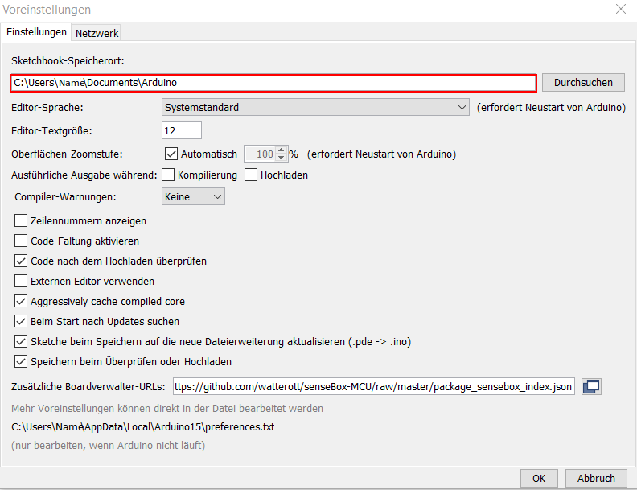

# Schritt 2: Libraries hinzufügen {#head}

<div class="description">Für die senseBox solltet Ihr zu Beginn unbedingt die senseBox-Library einbinden, um alle grundlegenden Methoden gegeben zu haben. Wo ihr die Libraries bekommt und wie ihr sie korrekt installiert erfahrt ihr hier.</div>
<div class="line">
    <br>
    <br>
</div>

## Libraries herunterladen und hinzufügen



Eine Library ist wie der Name schon sagt eine Sammlung von etwas - eine Sammlung von Methoden um genauer zu sein. Methoden sind in der Programmierung kleinere Abschnitte von Code die auf ein Objekt angewendet werden können. 
Bei der senseBox zum Beispiel kann eine Methode aufgerufen werden um die LEDs auf dem MCU ein- und auszuschalten. Es gibt eine Menge solcher Standardmethoden, die von einer Vielzahl an Programmmen benutzt werden. Um diese Methoden nicht alle einzeln in den Programmcode übertragen zu müssen, können sie in Libraries abgelegt werden. 
Eine Library ist also eine Datei, in der viele Methoden gespeichert werden. Man kann Libraries in seinen Code einbinden. Dafür reicht es wenn sie im Arduino-Ordner für Libraries gespeichert sind und man sie dann mit einer einzigen Zeile zu Beginn des Programmcodes einbindet. Das sieht in Arduino für die Library mit dem Namen "senseBoxIO" wie folgt aus: 

```arduino
#include <senseBoxMCU.h>;
```

Ist die Library eingebunden, können alle in ihr enthaltenen Methoden im Code benutzt werden. 




Bei der Installation der Libraries können sehr schnell Fehler auftreten, daher sollte man hier besonders genau auf die einzelnen Schritte achten. Um dich bei der Installation möglichst gut zu unterstützen, haben wir für jedes Betriebssystem eine seperate Anleitung geschrieben.
Wähle das zu deinem Computer passende System und folge den angegebenen Schritten.




# Libraries einfügen Windows

1. Im ersten Schritt lädst du ein `.zip`-Archiv mit dem Namen `senseBox_Libraries.zip` herunter. Darin befinden sich alle benötigten Bibliotheken, um mit den Sensoren und der MCU deiner senseBox Programme zu schreiben. Der Download erfolgt indem du [hier klickst](https://github.com/sensebox/resources/raw/master/libraries/senseBox_Libraries.zip).

2. Sollte der Download nicht von alleine starten, öffnet sich ein Fenster, in dem du das Feld ``Datei speichern`` auswählen musst und den Ordner an einen beliebigen Ort auf deinem Computer legst (standardmäßig ist das der Downloads-Ordner).

3. Nun öffnest du den Ordner, in dem du das `senseBox_Libraries.zip`-Archiv gespeichert hast und entpackst die `.zip` Datei mit Rechts-Klick -> `Alle extrahieren...`. Wähle als Speicherort denselben Ordner wie beim Download des `.zip`-Archivs (z.B. den Downloads-Ordner). Öffne den Ordner und schau dir den Inhalt an. In dem Ordner sollten zwei weitere Ordner mit den Namen `libraries` und `examples` liegen.

4. Öffne nun die Arduino IDE. Gehe auf `Datei` -> `Voreinstellungen`:

    

    und schaue im Feld unter `Sketchbook-Speicherort` nach an welchem Ort der Sketchbook Ordner gespeichert ist. 

    

    Merke dir den Pfad zu diesem Ordner, also den Ort wo dieser gespeichert ist.

    <div class="box_warning">
        <i class="fa fa-exclamation-circle fa-fw" aria-hidden="true" style="color: #f0ad4e"></i>
        Du musst die Libraries, die du bereits heruntergeladen und entpackt hast, im nächsten Schritt in den Sketchbook-Speicherort verschieben. Es ist daher sehr wichtig, dass du dir den entsprechenden Speicherort aus Punkt 4 genau merkst, um so später auftretende Fehler zu vermeiden.
    </div>

5. Nun navigierst du in deinem Datei-Explorer zum Sketchbook-Speicherort (siehe 4.). Beachte, dass der Zielordner im Datei-Explorer am Sketchbook-Speicherort den Namen `Arduino` trägt. Kopiere oder ziehe jetzt die beiden Ordner `libraries` und `examples` aus dem entpackten ``senseBox_Libraries.zip``-Archiv in den `Arduino`-Ordner am Sketchbook-Speicherort. Du kannst diese bedenkenlos "ersetzen", falls du danach gefragt wirst.  

6. Schließe jetzt das Programm Arduino vollständig und starte es erneut, um die Installation der entsprechenden Libraries abzuschließen. 


<div class="box_warning">
    <i class="fa fa-exclamation-circle fa-fw" aria-hidden="true" style="color: #f0ad4e"></i>
    Leider ist ein typischer Fehler, dass die senseBox Library nicht in den richtigen Ordner gelegt wird. Bitte überprüfe nochmal, ob du die Datei in den richtigen Ordner aus 4. gelegt hast.
</div>



# Libraries einfügen Mac
Coming soon...


# Libraries einfügen Linux
Coming soon...


