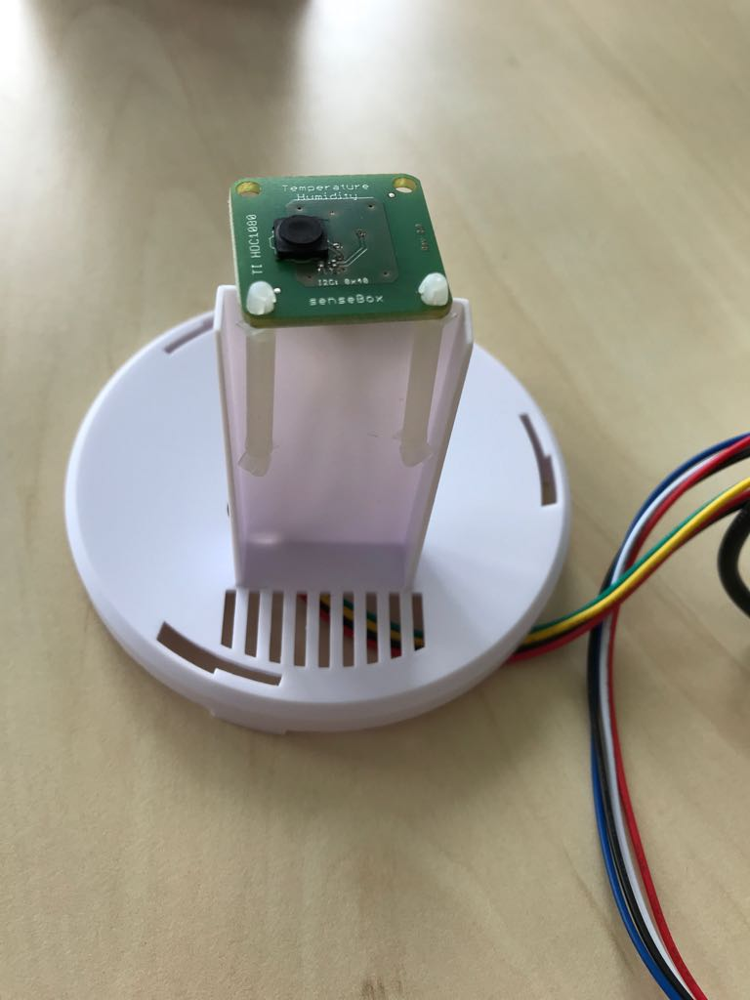
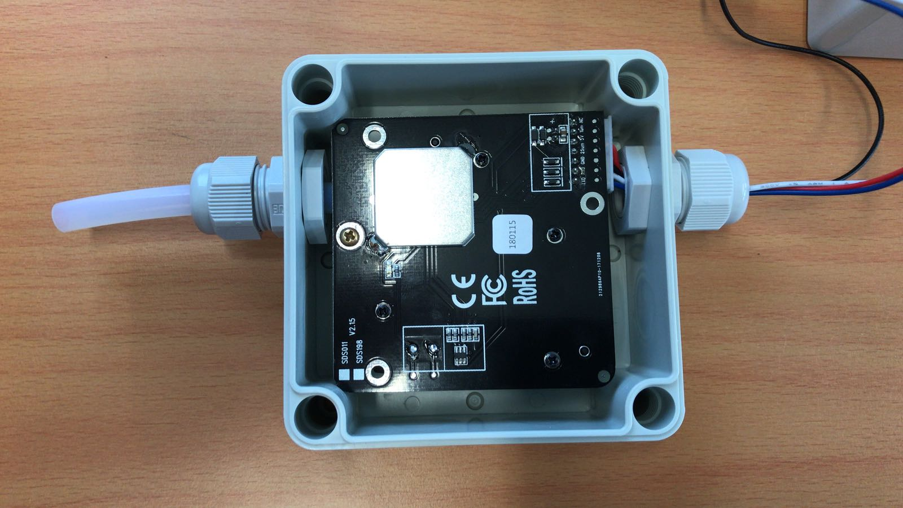

#Schritt 8: Zusammenbauen im Gehäuse {#head}

Im folgenden wird der Zusammenbau der senseBox:home im Gehäuse erklärt. 

     
     

##Inventarliste 

### Grundausstattung

- Gehäuse mit Deckel
- mini-USB Kabel + Adapter
- senseBox MCU 
- Sensor für Luftfeuchte und Temperatur + Tüte mit Zubehör
- Schutzgehäuse für Sensor mit Luftfeuchte und Temperatur
- Plexiglas mit Plastikstiften 
- M20 Gewinde 
- Tüte mit 8 Schrauben
- Bee

# Aufbau

## 1. Schritt

*senseBox MCU im Gehäuse anbringen:* 

Dazu richtest du die MCU so aus, dass der micro USB-Anschluss und der rote Knope zum Loch im Gehäuse zeigen.
Danach schraubst du die MCU mit zwei kleinen Schrauben am Gehäuse fest. Nutze dazu die beiden mittleren Löcher im MCU.

## 2. Schritt

*Anschließen vom Bee und Temperatur und Luftfeuchtigkeitssensor:*

Unanhängig davon, welches Bee du benutzt, musst du im nächsten Schritt dein Bee auf dem dafür vorgesehenen XBEE1 Steckplatz anbringen. 

## 3. Schritt

* Anschluss des Sensors und des mini-USB Kabels:*

Hierzu verschraubst du erst einmal das M20 Gewinde in dem Loch in der Seite des Gehäuses. 
Schraube anschließend die Kappe ab und stecke das Kabel (ohne Sensor) und das mini-USB Kabel durch die Öffnung vom Gewinde.
Jetzt kannst du die Kappe wieder auf das Gewinde drehen und den Sensor am Kabel Anschließen. 
Der Stecker des Sensors im Gehäuse kann auf einem der 5 *12C/Wire* Steckplätze angebracht werden.
**Das mini-USB Kabel solltest du erst am MCU anschließen, sobald alles aufgebaut ist.**

## 4. Schritt

*Sensor im Schutzgehäuse anbringen*

Das Schutzgehäuse ist dazu da, damit der Temperatur und Luftfeuchtigkeitssensor der Sonne nicht direkt ausgesetzt ist.
Um den Sensor im Gehäuse zu installieren, muss zunächst das Loch auf der Unterseite des Gehäuses erweitert werden, da dieser ansonsten nicht dort durch passt.

Jetzt kannst du den Sensor mit 2 Plastikstiften (siehe Foto) oder Spaghettibändern an dem kleinen Gerüst anbringen.
Mit dem Zubehör kannst du das Gehäuse nun da befestigen, wo du möchtest. 

    <i class="fa fa-exclamation-circle fa-fw" aria-hidden="true" style="color: #f0ad4e"></i>
    Achte drauf, dass der Sensor dabei nach oben zeigt! 

# Zusätzliche Komponenten 

hier kommt noch ein bild von den anderen sensoren hin!!!!

## 5. Schritt

Wenn du noch weitere Sensoren anschließen willst, bringst du zunächst die dafür vorhergesehenen Kabel auf den 12C/Wire Anschlüssen an. Wenn du einen Feinstaubsensor hast, steckst du das Kabel dafür zunächst durch das Gewinde. Anschließend  schließt das andere Ende des Kabels auf dem UART/Serial Port 1 an. 
Jetzt drückst du 4 Plastikstifte in die äußeren Löcher vom MCU.

## 6. Schritt

Als nächstes nimmst du dir das Plexiglas und entfernst die Folie.
Jetzt steckst du die Kabel jeweils durch das mittlere Loch in den Reihen, wo sich 3 Löcher befinden.
Platziere jetzt jeweils 2 Plastikstifte für einen Sensor und den kleinen Löchern so, das die Sensoren mittig auf dem Plexiglas angebracht werden können. **Dies ist vor allem wichtig für den UV Sensor!**

## 7. Schritt 

*Installation des Feinstaubsensors*

- Feinstaubsensor
- Gehäuse
- 2 M16 Gewinde
- Kabel
- Kunststoffröhre

a
Beim Anschluss vom Feinstaubsensor musst folgendermaßen vorgehen. 
Löse zunächst die Kappe und dann die Gummidichtung im Gewinde. 
Jetzt kannst du das Kabel vom Sensor nacheinander durch die gerade gelösten Komponenten stecken. 
Stecke das Kabel jetzt durch das Loch im Gehäuse und verbinde es mit dem Sensor.

    <i class="fa fa-exclamation-circle fa-fw" aria-hidden="true" style="color: #f0ad4e"></i>
An dieser Stelle solltest du das Gewinde noch nicht fest drehen. 

Stecke jetzt erst einmal die Kunststoffröhre auf den Eingang vom Feinstaubsensor und dann durch das andere Loch im Gehäuse. 
Nun kannst du die Gewinde auf beiden Seiten des Gehäuses fest drehen und den Deckel auf dem Gehäuse befestigen. 

## Fertiger Aufbau der senseBox:home Version

