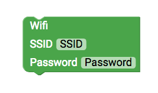

# Feinstaub Messstation {#head}

    In diesem kleinen Projekt soll eine Messsation gebaut werden, die den Feinstaubgehalt (PM10, PM2.5), Temperatur und Luftfeuchtigkeit
    an die openSenseMap überträgt.

     
     

## Materialien 
* senseBox MCU 
* senseBox Kabel 
* <a href="../komponenten/sensoren/hdc1080.html">Temperatur und Luftfeuchtigkeitssensor</a>
* <a href="../komponenten/sensoren/feinstaub.html">Feinstaubsensor</a> + Kabel 
* OLED Display 
* Wifi Bee 

## Grundlagen 
Feinstaub kann in verschiedenen Partikelgrößen gemessen werden. Standardmäßig werden Partikel mit einer Größe von unter 10µm oder 2.5µm gemessen. Der Messwert, den der Sensor ausgibt
entspricht dann der Konzentration von µg/m^3. Die Temperatur wird in grad Celsius und die Luftfeuchtigkeit in %RF ausgegeben.
Der Feinstaubsensor reagiert sehr stark auf erhöhte Luftfeuchtigkeit, daher sollte immer wenn der Feinstaubgehalt bestimmt
wird auch die Temperatur und Luftfeuchtigkeit gemessen werden um die Messwerte korrekt einordnen zu können. 
## Aufbau 
Verbinde im ersten Schritt das Wifi Bee mit dem XBee Steckplatz 1. Anschließend verbindest du mit dem senseBox Kabel das Display und
den Temperatur- und Luftfeuchtigkeitssensor mit den I2C/Wire Steckplätzen. Der Feinstaubsensor wird mit dem entsprechenden
Kabel an einen UART/Serial Anschluss angeschlossen. 

## Programmierung 

Nach dem Aufbau muss die Feinstaubmessstation noch programmiert werden.

<h6>Schritt 1: Hier wirst du lernen, wie das Display angeschlossen und angesteuert wird.</h6>

    

        

            
        

        

            <h4>Das OLED-Display</h4>
            <h6>Anschluss: I2C/Wire</h6>
            Das
            <a href="../komponenten/zubehoer/led-display.html">OLED-DISPLAY</a> hat eine Auflösung von 128x64 Pixeln und wird über den I2C Anschluss angeschlossen. Um das Display
            zu verwenden muss es im Setup() initialisiert werden.
        

    

  Nachdem das Display initialisiert wurde kannst du eine erste Ausgabe testen. Verwende dazu folgende Blöcke um einen einfachen
Textstring ausgeben zu lassen.
 

    

        

            
        

        

            <h4>Anzeige auf dem Display</h4>
            Dieser Block startet die Ausgabe auf dem Display. Ziehe in die Klammer deine Ausgabewerte.
        

    

    

        

            
        

        

            <h4>Display löschen</h4>
            Verwende diesen Block um den Inhalt des Displays zu löschen. Es empfiehlt sich am Anfang oder Ende der Endlosschleife das
            Display zu löschen um ein korrektes Anzeigen von z.B. Messwerten zu gewährleisten.
        

    

    

        

            
        

        

            <h4>Anzeigen von Text</h4>
            Mit diesem Block kannst du dir Text und Messwerte auf dem Display anzeigen lassen. Die Schriftfarbe ist Standardmäßig auf
            Weiß eingestellt, da das Display einen schwarzen Hintergrund hat. Du kannst neben der Schriftfarbe auch die Schriftgröße
            ändern. In Schriftgröße 1 ist ein Buchstabe oder eine Zahl 8 Pixel groß und du kannst dir insgesamt in 8 Zeilen
            auf dem Display verschiedene Texte anzeigen lassen. In Schriftgröße 2 sind die Buchstaben oder Zahlen 16 Pixel
            hoch. Mit den X- und Y-Werten gibst du an wo auf dem Display etwas angezigt wird.
        

    

#### Aufgabe Schritt 1:

Lasse dir einen Text auf dem Display anzeigen.

<button type="button" class="btn-modal" data-toggle="modal" data-target="#Modal-Display-Loesung">
        Lösung: Schritt 1
</button>

<!-- Modal begin -->

        

            

                

                    <h5 class="modal-title" id="ModalLabelDisplayLoesung">Lösung: Schritt 1</h5>
                    <button type="button" class="close" data-dismiss="modal" aria-label="Close">
                        &times;
                    </button>
                

                

                    

                        

                            <h6 align="center">Block</h6>
                            
                        

                        

                            <h6 align="center">Display Anzeige</h6>
                            
                        

                    

                

                

                    <button type="button" class="btn btn-modal" data-dismiss="modal">Schließen</button>
            

        

    

    

<h6>Schritt 2: Hier wirst du lernen, wie die Sensoren ausgelesen werden können.</h6>

Die Blöcke für das Auslesen der Sensoren findest du unter senseBox Sensoren. Die Sensoren haben verschiedene Ausgabewerte,
die du jeweils in dem Dropdown Menü auswählen kannst. Verwende für jeden Messwert eine eigene Variable um diesen zu speichern
und später wieder aufrufen zu können.

    

        

            
        

        

            <h4>Variablen</h4>
            In dem Menü Variablen findest du alle Blöcke, die du benötigst um mit Variablen zu arbeiten. Verwende für jeden Sensor eine
            neue Variable. Du kannst in dem Dropdown Menü des Variablen Blocks deine aktuelle Variable umbennen oder eine
            neue erstellen. Verbinde den Sensorblock mit der Variable um den Messwert der Variable zuzuordnen.
        

    

    

        

            
        

        

            <h4>Temperatur und Luftfeuchtigkeitssensor</h4>
            <h6>Anschluss: I2C/Wire</h6>
            Dieser Block gibt dir den Messwert des
            <a href="../komponenten/sensoren/hdc1080.html">Temperatur und Luftfeuchtigkeitssensor</a>. Im Dropdown Menü kannst du den jeweiligen Messwert auswählen. Dropdown:
            <ul>
                <li> Temperatur </li>
                <li> Luftfeuchtigkeit </li>
            </ul>
        

    

    

        

            
        

        

            <h4>Feinstaubsensor</h4>
            <h6>Anschluss: UART/Serial</h6>
            Dieser Block gibt dir den Messwert des
            <a href="../komponenten/sensoren/feinstaub.html">Feinstaubsensor</a> . Im Dropdown Menü kannst du den jeweiligen Messwert auswählen. Dropdown (Messwert):
            <ul>
                <li> PM10 </li>
                <li> PM2.5 </li>
            </ul>
            Dropdown:
            <ul>
                <li> Serial1 </li>
                <li> Serial2 </li>
            </ul>
        

    

##### Aufgabe Schritt 2
Lese alle Messwerte der Sensoren aus und speichere diese als Variable. Lasse dir anschließend alle Messwerte auf
dem Display anzeigen.
<button type="button" class="btn-modal" data-toggle="modal" data-target="#Modal-Lösung">
    Lösung: Schritt 2
</button>

<!-- Modal begin -->

    

        

            

                <h5 class="modal-title" id="ModalLabelLösung">Lösung: Schritt 2</h5>
                <button type="button" class="close" data-dismiss="modal" aria-label="Close">
                    &times;
                </button>
            

            

                

                    

                        <h6 align="center">Block</h6>
                        
                    

                    

                        <h6 align="center">Erläuterung</h6>
                        Im Setup wird das Display initialisiert. In der Endlosschleife werden zuerst alle Messwerte ausgelesen und einer Variable
                        zugewiesen. Anschließend werden die Variablen auf dem Display ausgegeben.
                    

                

            

            

                <button type="button" class="btn btn-modal" data-dismiss="modal">Schließen</button>
            

        

    

<h6> Im letzten Schritt stellen wir die Verbindung mit einen Wlan Netzwerk her. Und übertagen die Messwerte ins Internet an die
    openSenseMap</h6>

Für die Übertragung an die openSenseMap benötigst du neben deinen Zugangsdaten für das Wlan auch eine BoxID und ID (SensorID)
für die einzelnen Messwerte und Sensoren. Registriere eine neue senseBox auf der openSenseMap um die entsprechenden ID's
zu erhalten.

    

        

            
        

        

            <h4>Wlan Verbindung herstellen</h4>
            <h6>Anschluss: XBEE1</h6>
            Verwende diesen Block im Setup() um eine Wlan Verbindung herzustellen. Trage den entsprechenden Netzwerknamen (SSID) und
            das Passwort ein. Eine einfache Möglichkeit die Datenübertragung auch außerhalb von Gebäude herzustellen ist
            die Nutzung deines Handys und die Funktion eine Wlan Hotspot zu erstellen.

        

    

    

        

            
        

        

            <h4>Messintervall</h4>
            Damit das Übertragen der Messwerte nicht jede Sekunde erfolgt, sondern erst nach einem gewissen Zeitintervall kannst du diesen
            Block verwenden. Trage dazu die Zeit in Millisekunden ein.
        

    

    

        

            
        

        

            <h4>Übertragen der Messwerte an die openSenseMap</h4>
            Um Messwerte über Internet zu übertragen erstelle zunächst eine neue Messstation auf der
            <a href="https://opensensemap.org/register">openSenseMap</a> Bei der Registrierung musst du angeben ob es ich um eine stationäre oder mobile Station (benötigt
            GPS) handelt. Desweiteren wirst du gefragt, welche Sensoren und welche Messwerte du an die Plattform senden möchstest.
            Du kannst diese Parameter nach immer wieder ändern, falls du möchtest. Wichtig ist, dass du die BoxID kopierst
            und in diesen Block einfügst. Damit werden die Messwerte deiner senseBox zugeordnet.
        

    

    

        

            
        

        

            <h4>Messwerte übertragen</h4>
            Verwende diesen Block, wenn du eine stationäre senseBox registriert hast. Für jeden Messwert benögtist du jeweils einen eigenen
            Block, denn jeder Sensor/Messwert erhält zusätzlich zur BoxID eine spezifische und einmalige SensorID. Kopiere
            die jeweilige Sensor ID aus der Übersicht deiner Registrierung und hänge eine Messwert an, der Übertragen werden
            soll. Ziehe diesen Block in die Schleife des Blocks, der eine Verbindung zur openSenseMap herstellt.
        

    

<button type="button" class="btn-modal" data-toggle="modal" data-target="#Modal-Lösung-osem">
    Lösung: Schritt 3
</button>

<!-- Modal begin -->

    

        

            

                <h5 class="modal-title" id="ModalLabelLösungOsem">Lösung: Schritt 3</h5>
                <button type="button" class="close" data-dismiss="modal" aria-label="Close">
                    &times;
                </button>
            

            

                

                    

                        <h6 align="center">Block</h6>
                        
                    

                    

                        <h6 align="center">Erläuterung</h6>
                        Nachdem im Setup() eine Wlan verbindung hergestellt wurde wird in der Endlosschleife() das Messintervall eingestellt und die Verbindung zur openSenseMap hergestellt. Anschließend werden die Messwerte einzelnd übertragen. 
                    

                

            

            

                <button type="button" class="btn btn-modal" data-dismiss="modal">Schließen</button>
            

        

    

 

 

 #### Aufgabe
 Kombiniere die Schritte 1 bis 3 und erstelle einen Programmcode, der folgende Funktion hat:
 - Auslesen der Sensoren und speichern als Variablen
 - Anzeige der Messwerte auf dem Display
 - Übertragen der Messwerte über Wlan an die openSenseMap

